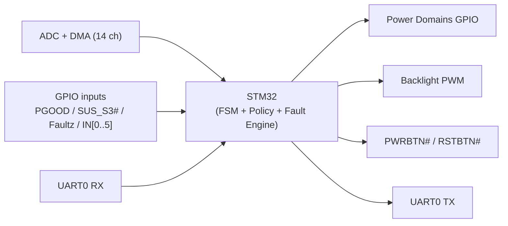

# POWER_Controller — Внешний контракт

Этот документ описывает **только внешний контракт и поведение** контроллера питания (MCU) по отношению к процессорному модулю **Q7**: дискретные интерфейсы, домены питания, правила безопасного состояния, UART-протокол и форматы телеметрии/команд.

---

## 1. Архитектура уровней и детерминированный порядок main loop

### 1.1 Конвейер `Input → Decision → Action` (границы ответственности)

- **Input**: ADC+DMA (14 каналов), GPIO-входы (`PGOOD`, `SUS_S3#`, `Faultz`, `IN_0..IN_5`), UART0 RX.
- **Decision**: политика применения UART-команд, FSM power sequencing, fault-логика (latched).
- **Action**: GPIO/PWM выходы доменов и ответы UART.



### 1.2 Фиксированный порядок выполнения

Один проход main loop выполняется строго в порядке:

1. UART RX/TX (парсинг/команды/ответы).
2. Обновление ADC-данных и derived метрик.
3. Шаг state machine power sequencing.
4. Шаг fault-логики и фиксация latched `fault_flags`.
5. Refresh IWDG — **ровно в одной точке** main loop, строго после шагов 1–4.

Инварианты IWDG:

- Refresh выполняется **не более 1 раза за итерацию** main loop (если IWDG включён).
- Refresh **запрещён** из ISR/HAL callback/низкоуровневых функций периферии — только в указанной точке main loop.

### 1.3 Частота main loop и параметры IWDG

Чтобы таймауты UART/секвенсов и watchdog были воспроизводимы, фиксируются ожидания по темпу выполнения:

- **Main loop**: целевая частота выполнения — **не ниже 1 кГц** в нормальном режиме (период итерации \(\le 1\) мс).
- **IWDG timeout**: **1000 мс** (рекомендуемое значение по умолчанию для проекта).
  - Конкретные значения prescaler/reload выбираются по STM32F0 IWDG (LSI).
  - refresh IWDG — **ровно в одном месте** main loop после шагов UART/ADC/FSM/fault.

### 1.4 ADC/DMA — фиксированный размер буфера и порядок каналов (инвариант)

Телеметрия и защитная логика опираются на DMA-буфер АЦП фиксированного размера и фиксированного порядка. Это часть внешнего контракта.

- `ADC_CHANNEL_COUNT = 14`
- DMA circular buffer имеет длину **ровно 14** элементов
- Порядок rank/index **неизменяемый**:

| Rank | DMA index | MCU pin | ADC channel | Net label           | Физ. величина |
| ---- | --------- | ------- | ----------- | ------------------- | ------------- |
| 1    | 0         | PA0     | ADC_IN0     | LCD_CURRENT_M       | ток           |
| 2    | 1         | PA1     | ADC_IN1     | BACKLIGHT_CURRENT_M | ток           |
| 3    | 2         | PA4     | ADC_IN4     | SCALER_CURRENT_M    | ток           |
| 4    | 3         | PA5     | ADC_IN5     | AUDIO_L_CURRENT_M   | ток           |
| 5    | 4         | PA6     | ADC_IN6     | AUDIO_R_CURRENT_M   | ток           |
| 6    | 5         | PA7     | ADC_IN7     | LCD_POWER_M         | напряжение    |
| 7    | 6         | PB0     | ADC_IN8     | BACKLIGHT_POWER_M   | напряжение    |
| 8    | 7         | PB1     | ADC_IN9     | SCALER_POWER_M      | напряжение    |
| 9    | 8         | PC0     | ADC_IN10    | V+24_M              | напряжение    |
| 10   | 9         | PC1     | ADC_IN11    | V+12_M              | напряжение    |
| 11   | 10        | PC2     | ADC_IN12    | V+5_M               | напряжение    |
| 12   | 11        | PC3     | ADC_IN13    | V+3.3_M             | напряжение    |
| 13   | 12        | PC4     | ADC_IN14    | Temp0_M             | температура\* |
| 14   | 13        | PC5     | ADC_IN15    | Temp1_M             | температура\* |

\* Температурные каналы — резерв/опционально. При отсутствии NTC в `GET_STATUS` `temp0/temp1` возвращаются как `-32768`.

## 2. Внешние системы и интерфейсы

### 2.1 Дискретные входы (в MCU)

- `PGOOD`: питание в норме (1 = HIGH).
- `SUS_S3#`: состояние сна/выключения Q7 (active LOW).
- `Faultz`: fault от усилителя (active LOW; 1 = HIGH означает “нет ошибки”).
- `IN_0..IN_5`: дополнительные дискретные входы; отдаются в `GET_STATUS.inputs`.

### 2.2 Дискретные выходы к Q7

- `PWRBTN#` (open-drain): формирование импульса для автозапуска Q7 (правило автозапуска описано в разделе 3.3).
- `RSTBTN#` (open-drain): линия упоминается как обязательная к “release” в `safe state` (MCU не должен удерживать её в LOW в безопасном состоянии).

### 2.3 Управление усилителем (аудиотракт)

MCU управляет линиями:

- `SDZ` (shutdown): безопасный уровень в `safe state` — **LOW**.
- `MUTE`: безопасный уровень в `safe state` — **HIGH**.

### 2.4 Домены питания (внешние нагрузки/подсистемы)

Домены, состояние которых отражается в `GET_STATUS.state`:

- `SCALER`
- `LCD`
- `BACKLIGHT`
- `AUDIO`
- `ETH1`
- `ETH2`
- `TOUCH`

Ключевой запрет (инвариант поведения):

- `BACKLIGHT` **нельзя включать**, если `SCALER=OFF` или `LCD=OFF`.

### 2.5 Подсветка (PWM + разрешение домена)

- `BACKLIGHT_ON` (GPIO): разрешение питания/включения подсветки как домена.
- `BL_PWM` (TIM17 CH1, 200 Гц): управление яркостью (команда `SET_BRIGHTNESS`).

Инвариант политики: включение `BACKLIGHT` разрешено только при `SCALER=ON` и `LCD=ON`.

### 2.6 Дисплейный тракт: reset LVDS моста

- `RST_CH7511b` (open-drain): аппаратный reset eDP/LVDS моста.
- Команда `RESET_BRIDGE`: импульс на `RST_CH7511b` при уже включённом дисплее.
  - Длительность импульса: **LOW 10 мс**, затем release (HIGH/Hi‑Z).

### 2.7 Прошивка/обновление: вход в ROM bootloader

- Штатно (по UART0): команда `BOOTLOADER_ENTER` переводит систему в `safe state`, отправляет ACK, затем инициирует reset и вход в ROM bootloader.
- Аппаратно (со стороны Q7): `BOOT0` и `NRST` могут управляться Q7 через I2C GPIO expander IC17.

Ограничение: MCU **не является** I2C-мастером для IC17 и не взаимодействует с ним по I2C; IC17 — часть интерфейса Q7↔плата, а не MCU↔периферия.

### 2.8 Отладка и сервисные интерфейсы

- `UART Debug`: отдельный UART для отладки (опционально; не часть внешнего контракта Q7↔MCU).
- `SWD` + `NRST`: прошивка/отладка по SWD.

### 2.9 GPIO pin-level mapping (MCU pin → signal → режим) (контракт интеграции)

Этот раздел фиксирует “**сигнал ↔ пин MCU ↔ режим GPIO ↔ активный уровень**”.

| Signal            | MCU pin    | GPIO mode       | Active level                     | Safe state     |
| ----------------- | ---------- | --------------- | -------------------------------- | -------------- |
| `UART0_TX`        | PA10       | USART TX        | —                                | —              |
| `UART0_RX`        | PA9        | USART RX        | —                                | —              |
| `PGOOD`           | PA8        | Input (no pull) | HIGH = ok                        | —              |
| `SUS_S3#`         | PC15       | Input (no pull) | LOW = sleep/off                  | —              |
| `Faultz`          | PC7        | Input (no pull) | LOW = fault                      | —              |
| `IN_0..IN_5`      | PB15..PB10 | Input (no pull) | 1 = idle (pull-up), 0 = asserted | —              |
| `SCALER_POWER_ON` | PB5        | Output PP       | HIGH = ON                        | LOW            |
| `LCD_POWER_ON`    | PB4        | Output PP       | HIGH = ON                        | LOW            |
| `BACKLIGHT_ON`    | PA15       | Output PP       | HIGH = ON                        | LOW            |
| `POWER_AUDIO`     | PC9        | Output PP       | HIGH = ON                        | LOW            |
| `POWER_ETH_1`     | PB7        | Output PP       | HIGH = ON                        | LOW            |
| `POWER_ETH_2`     | PB6        | Output PP       | HIGH = ON                        | LOW            |
| `POWER_TOUCH`     | PB2        | Output PP       | HIGH = ON                        | LOW            |
| `SDZ`             | PC8        | Output PP       | HIGH = enable                    | LOW            |
| `MUTE`            | PC6        | Output PP       | HIGH = mute                      | HIGH           |
| `RST_CH7511b`     | PB8        | Output OD       | LOW = assert                     | release (Hi‑Z) |
| `PWRBTN#`         | PC14       | Output OD       | LOW = assert                     | release (Hi‑Z) |
| `RSTBTN#`         | PC13       | Output OD       | LOW = assert                     | release (Hi‑Z) |
| `BL_PWM`          | PB9        | TIM17_CH1       | —                                | —              |

---

## 3. Безопасное состояние и правила поведения

### 3.1 Safe state (обязательные инварианты)

При старте системы и при любом fault MCU обязан привести систему в `safe state` со следующими минимальными требованиями:

- Все домены питания с active HIGH должны быть **OFF = GPIO LOW**.
- Линии `PWRBTN#` и `RSTBTN#` (open-drain) должны быть в **release** (не тянуть в LOW).
- Усилитель: `SDZ=LOW`, `MUTE=HIGH`.

### 3.2 Reset / boot behavior (контракт)

- **После любого reset** (POR/NRST/IWDG reset/`NVIC_SystemReset()`): MCU обязан **сразу** привести систему в `safe state` до обработки команд UART и до выполнения любых секвенсов.
- **SRAM magic** (для `BOOTLOADER_ENTER`):
  - при старте MCU проверяет SRAM magic; при наличии — очищает magic и выполняет jump в ROM bootloader `0x1FFF0000` (STM32F030).
  - при отсутствии — продолжает штатную инициализацию и работу приложения.

### 3.3 Автозапуск Q7 (Auto-Power-On)

MCU выполняет роль внешнего супервизора для Q7:

- Если `PGOOD` в норме, но `SUS_S3#` остаётся `LOW` более **500 мс**, MCU генерирует импульс `PWRBTN#` длительностью **150 мс**.
- Интервал между попытками запуска — **5 секунд**.

---

## 4. UART0 протокол обмена

### 4.1 Общие параметры и кадр

- **Baudrate**: 115200, 8N1.
- **Endian**: все многобайтные поля (`uint16`, `int16`, `uint32`) — **Little Endian**.

Готовность к приёму команд после reset:

- MCU обязан быть готов принимать UART-команды **не позднее чем через 100 мс** после reset.
- До истечения этого времени (или до первого успешно принятого пакета) хост должен быть готов к отсутствию ответа и повторной отправке (рекомендуемый способ синхронизации — `PING`).

Фрейм:

| Byte | Field | Description                  |
| :--- | :---- | :--------------------------- |
| 0    | STX   | `0x02`                       |
| 1    | CMD   | Код команды                  |
| 2    | LEN   | Длина `DATA` в байтах        |
| 3..N | DATA  | Параметры                    |
| N+1  | CRC8  | CRC по `[CMD][LEN][DATA...]` |
| N+2  | ETX   | `0x03`                       |

### 4.2 CRC (CRC-8/ATM)

CRC — **CRC-8/ATM**:

- `poly=0x07`
- `init=0x00`
- `refin=false`
- `refout=false`
- `xorout=0x00`

Расчёт CRC выполняется **строго по** `[CMD][LEN][DATA...]`. Байты `STX` и `ETX` в CRC **не входят**.

### 4.3 Протокольные инварианты

- `PING (0x01)` всегда отвечает `status=0xAA`.
- `GET_STATUS (0x04)` в ответе **всегда** имеет `LEN=26`, формат `DATA` и порядок полей **неизменяемые**.

### 4.4 Обработка ошибок и таймауты приёма (контракт)

- Экранирование/byte-stuffing **не используется**.
- При получении `STX (0x02)` UART-парсер начинает новый пакет (сбрасывает частично собранный пакет).
- Пакет с ошибкой CRC или невалидной структурой **игнорируется** (состояние системы не меняется, ответ не обязателен).
- Таймауты приёма:
  - межбайтовый: **10 мс**
  - общий таймаут пакета: **50 мс**

### 4.5 Ожидаемость ответа и поведение хоста (контракт)

- Для **валидного** пакета (корректная структура + CRC) MCU обычно отвечает согласно описанию команд.
- Для пакета с ошибкой CRC/структуры ответ **может отсутствовать**. Хост должен трактовать это как “пакет не принят” и при необходимости повторить команду.
- Для неизвестной команды MCU **может** ответить NACK в формате `CMD=0xFF`. Хост должен уметь обрабатывать как NACK, так и отсутствие ответа.

---

## 5. Команды UART и фиксированные LEN

`LEN` — длина поля `DATA` (без `STX/CRC/ETX`).

- `PING (0x01)`:
  - Request: `LEN=0`
  - Response: `LEN=1` (`status=0xAA`)
- `POWER_CTRL (0x02)`:
  - Request: `LEN=4` (`mask:uint16` + `value:uint16`)
  - Response: `LEN=1` (`status:uint8`)
- `SET_BRIGHTNESS (0x03)`:
  - Request: `LEN=2` (`pwm:uint16`, 0..1000)
  - Response: `LEN=1` (`status:uint8`)
- `GET_STATUS (0x04)`:
  - Request: `LEN=0`
  - Response: `LEN=26` (строго фиксировано)
- `RESET_FAULT (0x05)`:
  - Request: `LEN=0`
  - Response: `LEN=1` (`status:uint8`)
- `RESET_BRIDGE (0x06)`:
  - Request: `LEN=0`
  - Response: `LEN=1` (`status:uint8`)
- `SET_THRESHOLDS (0x07)`:
  - Request: `LEN` переменный (формат задаётся `mask` и набором полей в `DATA`)
  - Response: `LEN=1` (`status:uint8`)
- `BOOTLOADER_ENTER (0x08)`:
  - Request: `LEN=0`
  - Response: `LEN=1` (`status:uint8`)
  - Внешнее поведение:
    - MCU переводит систему в `safe state`.
    - MCU отправляет ответ (ACK/NACK через `status`).
    - При `status=0x00` MCU инициирует перезапуск для входа в режим обновления; после отправки ответа UART-связь с прикладной прошивкой MCU будет потеряна (Q7 должен быть готов к разрыву связи и повторной инициализации обмена после возвращения MCU).
- `CALIBRATE_OFFSET (0x09)`:
  - Request: `LEN=0`
  - Response: `LEN=1` (`status:uint8`)

### 5.1 `POWER_CTRL (0x02)` — битовая карта mask/value (контракт)

`POWER_CTRL` управляет доменами питания через пару полей:

- `mask:uint16` — какие биты (домены) применить
- `value:uint16` — целевые значения этих битов (0=OFF, 1=ON)

Правило применения:

- Для каждого бита \(i\): если `mask[i]=1`, то домен \(i\) устанавливается в `value[i]`. Если `mask[i]=0`, домен \(i\) не изменяется.

Общее правило целостности применения (инвариант политики):

- Если **хотя бы одно** изменение, запрошенное `POWER_CTRL`, нарушает инварианты/политику (например, приводит к состоянию `BACKLIGHT=ON` при `SCALER=OFF` или `LCD=OFF`, или требует запрещённого частичного секвенса), MCU обязан **отклонить всю команду целиком**: вернуть `status=0x01` и **не применять никакие изменения** из этого `POWER_CTRL` (запрещено частичное применение).

Биты доменов (должны совпадать с `GET_STATUS.state`:

| Bit | Домен       | Маска           |
| --: | ----------- | --------------- |
|   0 | `SCALER`    | `DOM_SCALER`    |
|   1 | `LCD`       | `DOM_LCD`       |
|   2 | `BACKLIGHT` | `DOM_BACKLIGHT` |
|   3 | `AUDIO`     | `DOM_AUDIO`     |
|   4 | `ETH1`      | `DOM_ETH1`      |
|   5 | `ETH2`      | `DOM_ETH2`      |
|   6 | `TOUCH`     | `DOM_TOUCH`     |

### 5.2 Примеры кадров (hex) с CRC-8/ATM (контракт)

Ниже приведены **проверочные** примеры байтового представления пакетов (включая `STX/ETX`) с корректным CRC-8/ATM по `[CMD][LEN][DATA...]`:

- `PING` request (`CMD=0x01, LEN=0`):
  - `02 01 00 15 03`
- `PING` response (`DATA=status=0xAA`):
  - `02 01 01 AA 21 03`
- `GET_STATUS` request (`CMD=0x04, LEN=0`):
  - `02 04 00 54 03`
- `POWER_CTRL` request: включить `SCALER` и `LCD` (`mask=0x0003, value=0x0003`):
  - `02 02 04 03 00 03 00 D8 03`
- `SET_BRIGHTNESS` request: `pwm=500`:
  - `02 03 02 F4 01 AB 03`

---

## 6. Телеметрия `GET_STATUS` (CMD=0x04)

### 6.1 Формат `DATA` (26 байт, порядок неизменяемый)

Температурные поля `temp0/temp1` являются резервом; при отсутствии NTC возвращаются как **`-32768`**.

Оговорка по сериализации (важно для реализации на стороне MCU и для хоста):

- Wire-формат задаётся **по байтам** согласно таблице offsets ниже, **нельзя** полагаться на `struct` без явного `packed`/ручной сериализации.
- Поле `fault_flags:uint16` начинается с `offset=23` (невыравненно); это нормально для wire-формата, но является частой причиной ошибок при наивном `memcpy`/кастах.

| Offset | Field         | Type   | Description                                                        |
| :----- | :------------ | :----- | :----------------------------------------------------------------- |
| 0      | `v24`         | uint16 | Напряжение 24V (мВ)                                                |
| 2      | `v12`         | uint16 | Напряжение 12V (мВ)                                                |
| 4      | `v5`          | uint16 | Напряжение 5V (мВ)                                                 |
| 6      | `v3v3`        | uint16 | Напряжение 3.3V (мВ)                                               |
| 8      | `i_lcd`       | uint16 | Ток LCD (мА)                                                       |
| 10     | `i_backlight` | uint16 | Ток подсветки (мА)                                                 |
| 12     | `i_scaler`    | uint16 | Ток scaler (мА)                                                    |
| 14     | `i_audio_l`   | uint16 | Ток audio L (мА)                                                   |
| 16     | `i_audio_r`   | uint16 | Ток audio R (мА)                                                   |
| 18     | `temp0`       | int16  | Температура 0 (резерв; при отсутствии NTC = -32768)                |
| 20     | `temp1`       | int16  | Температура 1 (резерв; при отсутствии NTC = -32768)                |
| 22     | `state`       | uint8  | Битовая маска доменов (SCALER/LCD/BACKLIGHT/AUDIO/ETH1/ETH2/TOUCH) |
| 23     | `fault_flags` | uint16 | Защёлкнутая (latched) маска причин fault                           |
| 25     | `inputs`      | uint8  | Битовая маска входов (IN_0..IN_5, PGOOD, Faultz)                   |

### 6.2 Битовая карта `state:uint8`

Биты соответствуют доменам питания и **обязаны оставаться неизменными**:

| Bit | Домен       | Маска           |
| --: | ----------- | --------------- |
|   0 | `SCALER`    | `DOM_SCALER`    |
|   1 | `LCD`       | `DOM_LCD`       |
|   2 | `BACKLIGHT` | `DOM_BACKLIGHT` |
|   3 | `AUDIO`     | `DOM_AUDIO`     |
|   4 | `ETH1`      | `DOM_ETH1`      |
|   5 | `ETH2`      | `DOM_ETH2`      |
|   6 | `TOUCH`     | `DOM_TOUCH`     |
|   7 | (reserved)  | 0               |

Примечание по `AUDIO`: `DOM_AUDIO=1` означает, что питание аудиотракта включено. При этом усилитель **может** удерживаться в безопасном состоянии (`SDZ=LOW`, `MUTE=HIGH`) до явной команды (если такая политика применена в прошивке).

### 6.3 Битовая карта `inputs:uint8`

- `bit0..bit5` = `IN_0..IN_5`
- `bit6` = `PGOOD` (1 = HIGH, питание в норме)
- `bit7` = `Faultz` (1 = HIGH, ошибки усилителя нет; 0 = LOW, fault)

### 6.4 `fault_flags:uint16` — latched причины fault

`fault_flags` — защёлкнутая маска причин, из‑за которых система была переведена в `safe state` или было запрещено включение/продолжение работы. Биты (LSB=bit0):

| Bit | Имя                | Смысл                                                                |
| --: | ------------------ | -------------------------------------------------------------------- |
|   0 | `FAULT_SCALER`     | fault, связанный с `SCALER`                                          |
|   1 | `FAULT_LCD`        | fault, связанный с `LCD`                                             |
|   2 | `FAULT_BACKLIGHT`  | fault, связанный с `BACKLIGHT`                                       |
|   3 | `FAULT_AUDIO`      | fault, связанный с `AUDIO`                                           |
|   4 | `FAULT_ETH1`       | резерв                                                               |
|   5 | `FAULT_ETH2`       | резерв                                                               |
|   6 | `FAULT_TOUCH`      | резерв                                                               |
|   7 | `FAULT_PGOOD_LOST` | потеря `PGOOD`                                                       |
|   8 | `FAULT_AMP_FAULTZ` | подтверждённый fault по входу `Faultz`                               |
|   9 | `FAULT_V24_RANGE`  | `+24V` вне допустимого диапазона                                     |
|  10 | `FAULT_V12_RANGE`  | `+12V` вне допустимого диапазона                                     |
|  11 | `FAULT_V5_RANGE`   | `+5V` вне допустимого диапазона                                      |
|  12 | `FAULT_V3V3_RANGE` | `+3.3V` вне допустимого диапазона                                    |
|  13 | `FAULT_SEQ_ABORT`  | прервано включение/работа дисплейной подсистемы из‑за условий защиты |
|  14 | `FAULT_INTERNAL`   | внутренняя ошибка, приведшая к защитному отключению                  |
|  15 | `FAULT_RESERVED`   | зарезервировано (должно оставаться 0)                                |

Политика:

- `fault_flags` **не сбрасываются автоматически**.
- `RESET_FAULT` очищает `fault_flags`, но **не включает** домены автоматически.
- Порядок реакции при подтверждённом fault: **сначала** перевод в `safe state`, **затем** фиксация (защёлкивание) соответствующих битов `fault_flags`.

---

## 7. Командная политика и статусы

### 7.1 Статус в ответах

Для большинства команд (кроме `PING`) ответ содержит `status:uint8`:

- `status=0x00` — выполнено
- `status=0x01` — запрос некорректен и/или запрещён политикой (состояние не меняется)

Для неизвестной команды допускается ответ **NACK** отдельным кодом команды:

- Response: `CMD=0xFF`, `LEN=1`, `DATA=error_code:uint8`
- Минимальные коды:
  - `0x01` — unknown command
  - `0x02` — RX packet queue overflow (команда не принята к обработке)

### 7.2 `POWER_CTRL (0x02)` — обязательные запреты

- Запрос `BACKLIGHT=ON` при `SCALER=OFF` или `LCD=OFF`:
  - вернуть `status=0x01`
  - ничего не менять (никаких частичных включений)

При отключении доменов, если `BACKLIGHT` был включён, MCU обязан обеспечить отсутствие состояния “подсветка включена при выключенных `SCALER/LCD`” (результат должен соответствовать инварианту 2.4).

### 7.3 `SET_THRESHOLDS (0x07)` — формат и единицы

Назначение: изменить пороги защит в рантайме по UART.

Формат `DATA`:

```
uint16_t mask;          // какие пороги меняем
// затем — только те значения, которые отмечены в mask, строго в порядке:
uint16_t v24_min,  v24_max;
uint16_t v12_min,  v12_max;
uint16_t v5_min,   v5_max;
uint16_t v3v3_min, v3v3_max;
uint16_t i_lcd_max;
uint16_t i_bl_max;
uint16_t i_scaler_max;
uint16_t i_audio_l_max;
uint16_t i_audio_r_max;
```

Единицы:

- напряжения — мВ
- токи — мА

Биты `mask`:

- bit0: `V24_MIN/V24_MAX`
- bit1: `V12_MIN/V12_MAX`
- bit2: `V5_MIN/V5_MAX`
- bit3: `V3V3_MIN/V3V3_MAX`
- bit8: `I_LCD_MAX`
- bit9: `I_BACKLIGHT_MAX`
- bit10: `I_SCALER_MAX`
- bit11: `I_AUDIO_L_MAX`
- bit12: `I_AUDIO_R_MAX`

Валидация (внешний контракт):

- `mask` не содержит неизвестных битов
- для напряжений: `min < max`
- для токов: `max > 0`
- `LEN` должен строго соответствовать `mask` (запрещены и недостающие поля, и “лишние байты”)

---

## 8. Подтверждение аварий (fault) и фильтрация (контракт)

Подтверждение выхода параметра за пределы выполняется **детерминированно**:

- У усреднения есть окно: **8 измерений**.
- Подтверждение аварии: **5 последовательных измерений подряд** вне порога/диапазона.
- Любое измерение, попавшее в норму, **сбрасывает** consecutive‑счётчик подтверждения (не используется правило “5 из 8”).

---

## 9. Дополнительные инварианты внешнего поведения

### 9.1 `PGOOD` и запрет дисплейных секвенсов

Секвенсы, связанные с дисплейной подсистемой (`SCALER/LCD/BACKLIGHT`), зависят от `PGOOD`:

- При `PGOOD=LOW` запуск/продолжение секвенсов дисплея **запрещены**.
- Падение `PGOOD` во время секвенса/работы дисплея приводит к аварийному выключению дисплейной подсистемы и фиксации fault (как минимум `FAULT_PGOOD_LOST`, а также `FAULT_SEQ_ABORT` при прерывании секвенса).

### 9.2 `BOOTLOADER_ENTER (0x08)` — обязательные детали

Для команды `BOOTLOADER_ENTER (0x08)` действуют инварианты:

- Перед reset MCU переводит систему в `safe state`.
- Перед reset MCU отправляет ACK (`status=0x00`) и **дожидается завершения передачи UART**.
- Вход в ROM bootloader выполняется детерминированно: после reset при обнаружении SRAM magic выполняется jump в системную память `0x1FFF0000` (STM32F030).

### 9.3 ADC raw→mV и выравнивание (alignment)

Опорное напряжение АЦП фиксировано как `VDDA=2.5 В`.

- Для 12-bit **Right alignment**: `mv = raw * 2500 / 4096`.
- Для 12-bit **Left alignment**: перед пересчётом обязательно `raw >>= 4`.

Допуск по точности телеметрии (для хоста):

- Значения напряжений/токов в `GET_STATUS` допускаются с погрешностью **±10%** (если не оговорено иное калибровкой/конфигурацией порогов). Это допуск на итоговое телеметрическое значение, учитывающий АЦП, опорное, делители/датчики и целочисленный пересчёт.

### 9.4 Тайминги display power sequencing (минимальный контракт)

Чтобы поведение включения/выключения дисплейной подсистемы было воспроизводимым, фиксируются минимальные задержки и таймауты подтверждения напряжений (исполняются через state machine + `systick_ms`, без `HAL_Delay()`):

Включение (логические шаги):

- После `SCALER_POWER_ON=ON`: выдержка **50 мс**, подтверждение по АЦП с таймаутом **200 мс**.
- После release `RST_CH7511b`: выдержка **20 мс**.
- После `LCD_POWER_ON=ON`: выдержка **50 мс**, подтверждение по АЦП с таймаутом **200 мс**.
- После `BACKLIGHT_ON=ON`: запуск PWM, подтверждение по АЦП с таймаутом **200 мс**.

Выключение (логические шаги):

- Перед `BACKLIGHT_ON=OFF`: `PWM=0`, выдержка **10 мс**.
- После `BACKLIGHT_ON=OFF`: выдержка **20 мс**.
- После `LCD_POWER_ON=OFF`: выдержка **20 мс**.
