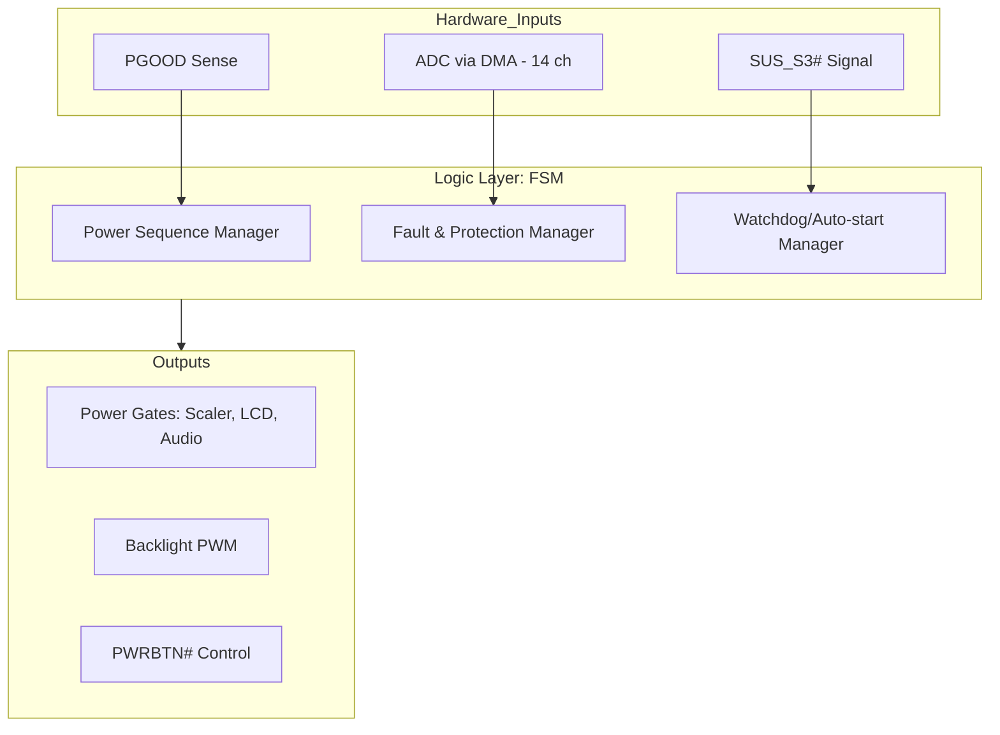
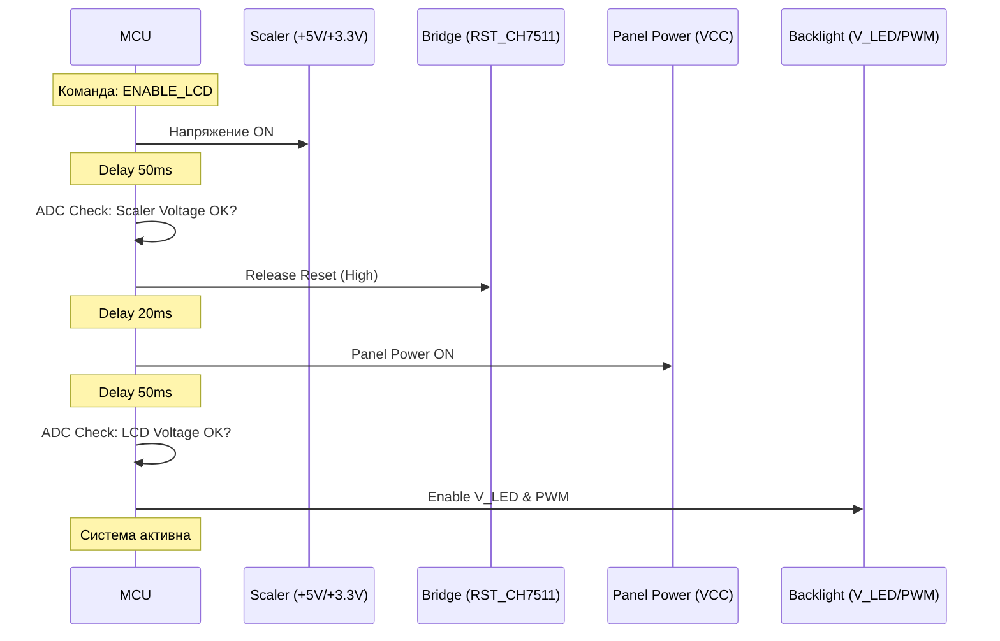
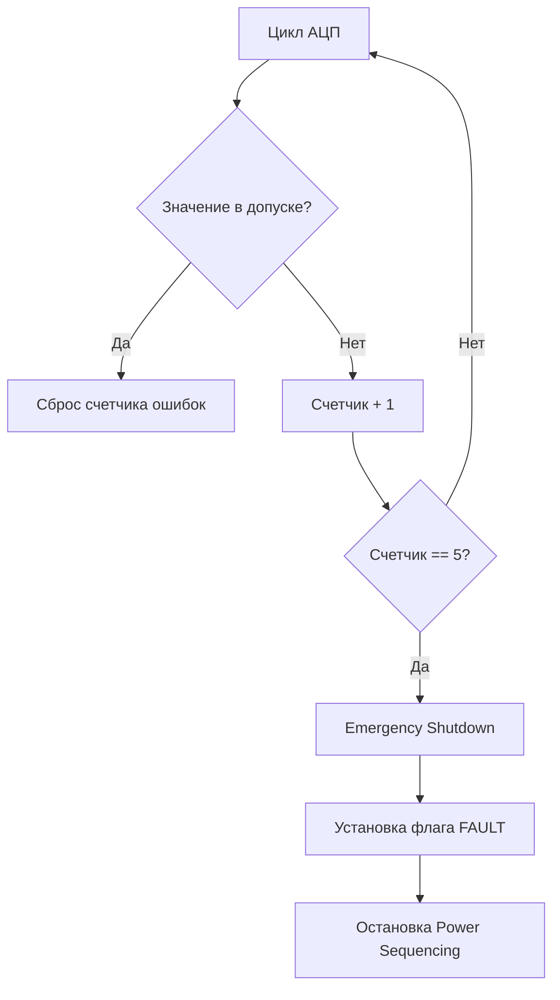
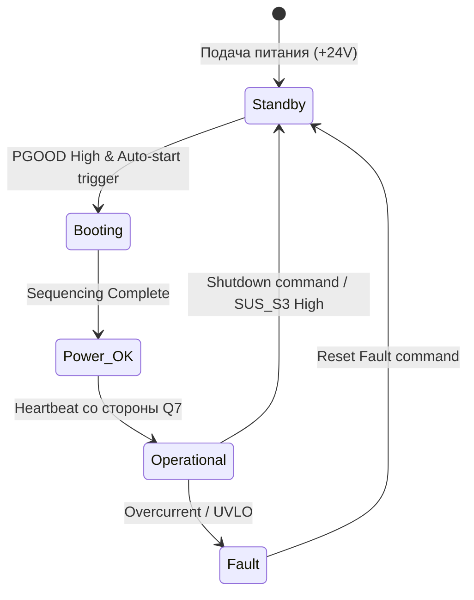

Вот глубоко детализированная техническая документация, структурированная для инженера-разработчика или системного интегратора. Она объединяет аппаратные требования, логику работы конечных автоматов и протоколы обмена.

---

# Техническая спецификация: Контроллер управления питанием (MCU Power)

**Микроконтроллер:** STM32F030R8T6  
**Тактовая частота:** 32 МГц (внешний кварц 8 МГц + PLL)  
**Роль в системе:** Детерминированный контроллер безопасности, управления питанием (Power Sequencing) и мониторинга периферии.

---

## 1. Архитектура уровней управления

Система разделена на три функциональных уровня:
1.  **Hardware Abstraction (HAL):** Сбор данных через DMA (АЦП), управление GPIO и ШИМ.
2.  **Logic Layer (FSM):** Конечные автоматы, управляющие последовательностью включения и защитой.
3.  **Communication Layer:** Обработка команд UART и формирование телеметрии.

---

## 2. Алгоритм Power Sequencing (Видеоподсистема)

Для исключения повреждения LCD-панели и моста CH7511b, включение происходит по строгому графику. Любое отклонение напряжения на промежуточном этапе останавливает процесс.

---

## 3. Система мониторинга и защиты (Fault Engine)

Контроллер опрашивает 14 каналов АЦП. Для исключения ложных срабатываний от пусковых токов используется алгоритм фильтрации (Glitch Filter).

### 3.1 Логика обработки аварии
1.  **Сэмплирование:** Данные усредняются по 16 значениям через DMA.
2.  **Детекция:** Если значение выходит за порог `High` или `Low`, инкрементируется счетчик ошибок конкретного канала.
3.  **Триггер:** При достижении счетчиком значения `5`, домен питания немедленно отключается.
4.  **Блокировка (Latch):** Состояние ошибки сохраняется до получения команды `RESET_FAULT`.

---

## 4. Взаимодействие с процессорным модулем (Q7)

### 4.1 Автозапуск (Auto-Power-On)
MCU выполняет роль внешнего супервизора для модуля Q7.
* Если `PGOOD` в норме, но сигнал `SUS_S3#` остается `LOW` (процессор в сне или выключен) более 500 мс, MCU генерирует импульс `PWRBTN#` длительностью 150 мс.
* Интервал между попытками запуска — 5 секунд.

### 4.2 Протокол обмена (UART0)
Связь осуществляется кадрами фиксированной структуры.
* **Baudrate:** 115200, 8N1.
* **Checksum:** CRC8 (полином 0x07).

| Byte | Field | Description |
| :--- | :--- | :--- |
| 0 | STX | `0x02` (Start of Text) |
| 1 | CMD | Код команды (напр. `0x02` - Power Control) |
| 2 | LEN | Длина поля данных |
| 3..N | DATA | Параметры команды |
| N+1 | CRC8 | Контрольная сумма заголовка и данных |
| N+2 | ETX | `0x03` (End of Text) |

---

## 5. Распределение каналов АЦП и калибровка

Важной особенностью является использование внешнего источника опорного напряжения **VREF = 2500 мВ**.

| Канал АЦП | Параметр | Коэффициент деления | Описание |
| :--- | :--- | :--- | :--- |
| CH0 | +24V_IN | 11.616 | Основной ввод питания |
| CH1 | +12V_OUT | 11.616 | Питание периферии |
| CH5 | CUR_LCD | (I * R * Gain) | Ток потребления панели |
| CH9 | TEMP_1 | NTC | Температура зоны VRM |

**Хранение калибровки:** Константы смещения (Zero Offset) для датчиков тока хранятся во Flash по адресу `0x0800FC00`. При первом запуске или по команде `CALIBRATE`, MCU измеряет ток при выключенной нагрузке и сохраняет это значение как "ноль".

---

## 6. Режимы обновления (Bootloader)

Для обновления прошивки без вскрытия устройства реализован переход в системный Bootloader STM32:
1.  Получение команды `ENTER_BOOTLOADER` (0x08).
2.  Запись "магического числа" в RAM.
3.  Программный сброс (System Reset).
4.  На раннем этапе инициализации проверка числа в RAM -> переход на адрес `0x1FFF0000`.

---

## 7. Карта состояний системы (System States)

---
**Примечание для разработчика:** Все временные задержки реализованы на неблокирующих таймерах. Основной цикл (Main Loop) должен иметь время итерации не более 1 мс для обеспечения оперативной реакции системы защиты.