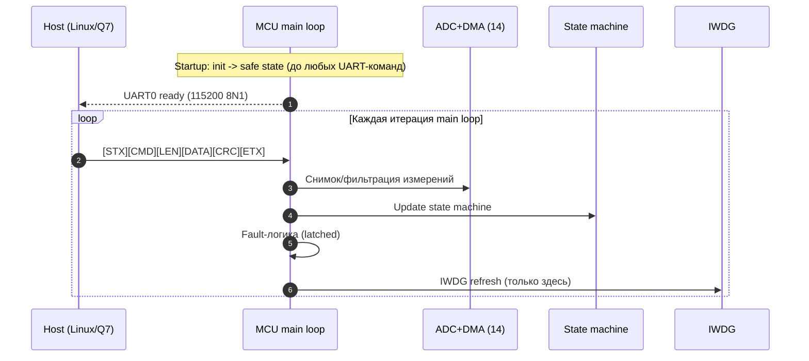
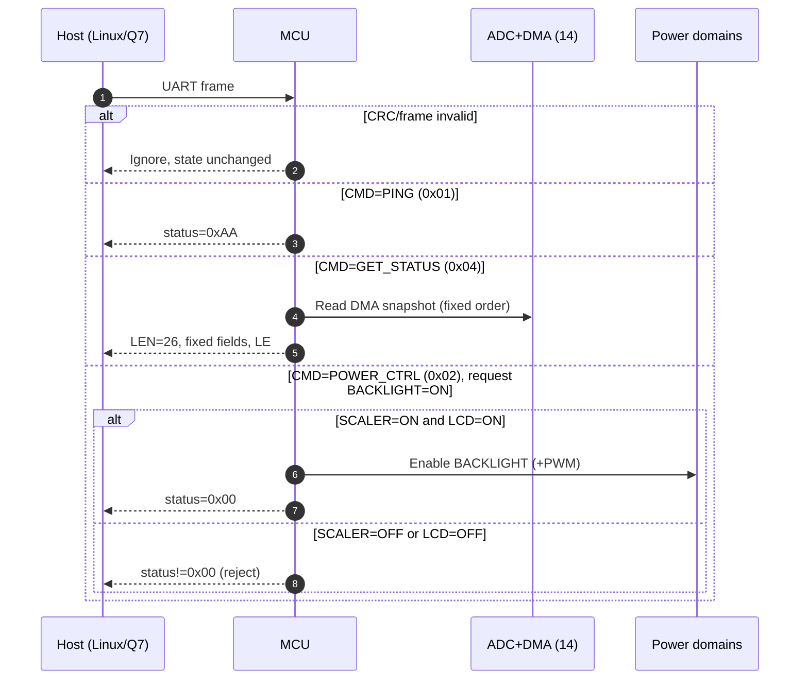
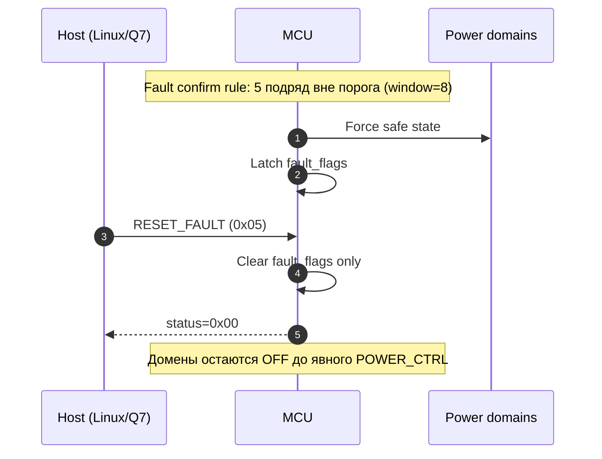
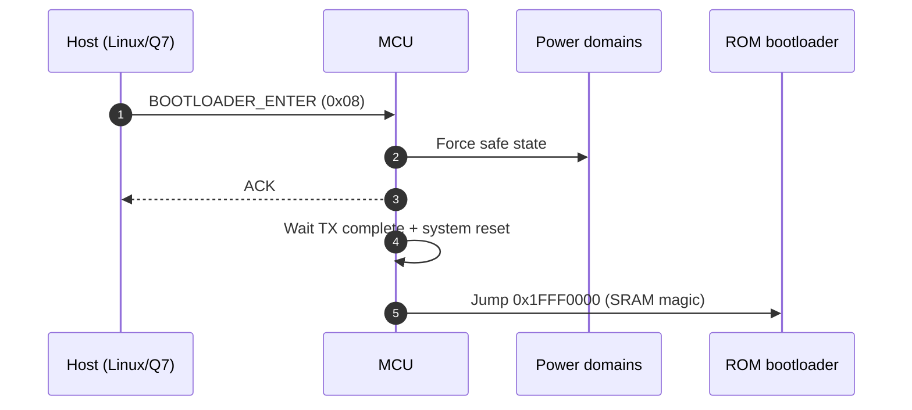

## POWER_Controller — кратко для тестирования

Этот документ — **тест‑ориентированная выжимка**, без изменения контракта. **Главный источник правды**: `Rules_POWER.md`. Если здесь и в `Rules_POWER.md` есть расхождения — верным считается `Rules_POWER.md`.

---

## 1) Что проверяем (с точки зрения тестировщика)

Контроллер:

- **управляет доменами питания**: `SCALER`, `LCD`, `BACKLIGHT`, `AUDIO`, `ETH1`, `ETH2`, `TOUCH`;
- **отдаёт телеметрию** (напряжения/токи/температуры, состояние, faults) по `UART0`;
- **фиксирует аварии (fault) защёлкой** и переводит систему в **safe state**;
- **делает power sequencing дисплея** (через state machine, без `HAL_Delay()`).

Что важно именно для тестов (инварианты):

- **safe state обязателен** на старте и после любого fault (см. `Rules_POWER.md` п. 25–28, 42);
- **fault не сбрасывается сам** (latched) и **не приводит к “самовключению”** после `RESET_FAULT` (см. `Rules_POWER.md` п. 22, 21);
- **подсветка запрещена**, если `SCALER=OFF` или `LCD=OFF` (см. `Rules_POWER.md` п. 23–24).

---

## 2) Быстрые чек-листы (E2E)

### 2.1 Старт устройства (ожидаемое поведение)

- **До любых команд по UART** система должна быть в **safe state**.
- Все домены питания **OFF**, `PWRBTN#`/`RSTBTN#` — **release**, усилитель в **SDZ=LOW / MUTE=HIGH**.
- Подсветка **не включается автоматически**.

### 2.2 Нормальный сценарий дисплея

- `SCALER ON` → затем `LCD ON` → только потом допустимо `BACKLIGHT ON`.
- При `BACKLIGHT ON` должен стартовать PWM (если реализован) и подсветка физически включается.

### 2.3 Авария (fault) и восстановление

- При подтверждённой аварии: **сначала** уход в safe state, **потом** выставление `fault_flags`.
- После `RESET_FAULT`: `fault_flags` очищаются, но **домены остаются OFF** до явной команды включения.

---

## 3) Диаграммы для тестирования (основные сценарии)

Диаграммы ниже **не вводят новых требований** и предназначены для того, чтобы тесты “попадали” в инварианты `Rules_POWER.md`.

### 3.1 Старт и цикл `main loop` (важно для IWDG и порядка обработки)

### 3.2 Команды `PING`, `GET_STATUS` и запрет на `BACKLIGHT`

### 3.3 Fault (latched) и `RESET_FAULT`

### 3.4 `BOOTLOADER_ENTER` (штатный путь прошивки)

---

## 4) Интерфейс тестов по UART (минимум)

### 4.1 Что обязательно фиксировано

- UART0: **115200 8N1**, без flow control (см. `Rules_POWER.md` п. 11).
- Frame: `[STX][CMD][LEN][DATA][CRC][ETX]`, `STX=0x02`, `ETX=0x03` (см. `Rules_POWER.md` п. 12–13).
- CRC: **CRC-8/ATM** по `[CMD][LEN][DATA...]` (см. `Rules_POWER.md` п. 14).
- `PING (0x01)` всегда отвечает `status=0xAA` (см. `Rules_POWER.md` п. 16).
- `GET_STATUS (0x04)` всегда **`LEN=26`** и **фиксированный порядок полей** (см. `Rules_POWER.md` п. 17–18).

### 4.2 Минимальный набор команд для E2E

- `PING (0x01)`: проверка живости.
- `GET_STATUS (0x04)`: снятие телеметрии/флагов/состояния.
- `POWER_CTRL (0x02)`: включение/выключение доменов (в т.ч. проверка запрета подсветки).
- `RESET_FAULT (0x05)`: сброс latched flags (без автозапуска доменов).
- `BOOTLOADER_ENTER (0x08)`: уход в ROM bootloader (с предварительным safe state).

---

## 5) Ожидаемые “жёсткие” реакции (что считать PASS/FAIL)

### 5.1 Safe state (PASS)

- Все домены питания **OFF**.
- `PWRBTN#`/`RSTBTN#` — **release**.
- Усилитель: **`SDZ=LOW`**, **`MUTE=HIGH`**.
- `BACKLIGHT` **OFF**.

### 5.2 Fault (PASS)

- При fault домены уходят в safe state, а `fault_flags` **защёлкиваются** до `RESET_FAULT`.
- После `RESET_FAULT` домены **не включаются** автоматически.

### 5.3 Подсветка (PASS)

- `BACKLIGHT ON` возможен **только при** `SCALER=ON` и `LCD=ON`.
- Попытка включить подсветку при `SCALER=OFF` или `LCD=OFF` должна быть **отклонена** и физически не включить подсветку.

---

## 6) Детали (чтобы не мешали основному чтению)

Эти разделы нужны для точной привязки тестов к железу/телеметрии и для отладки “почему тест упал”. Они повторяют требования `Rules_POWER.md` в более удобном виде.

### 6.1 Домены питания (битовая маска)

Маска доменов `bits 0..6` (используется в `POWER_CTRL` и в `GET_STATUS.state`, см. `Rules_POWER.md` п. 19):

- bit0: `SCALER`
- bit1: `LCD`
- bit2: `BACKLIGHT`
- bit3: `AUDIO`
- bit4: `ETH1`
- bit5: `ETH2`
- bit6: `TOUCH`

### 6.2 `GET_STATUS` (LEN=26) — состав полей

Порядок полей фиксирован (см. `Rules_POWER.md` п. 18):

`v24,u16; v12,u16; v5,u16; v3v3,u16; i_lcd,u16; i_bl,u16; i_scaler,u16; i_audio_l,u16; i_audio_r,u16; temp0,i16; temp1,i16; state,u8; fault_flags,u16; inputs,u8`

### 6.3 ADC/DMA — фиксированный порядок каналов (14)

**Запрещено менять порядок.** DMA index 0..13 соответствует ranks 1..14 (см. `Rules_POWER.md` п. 31–33).

| DMA index | Pin | Сигнал                | Назначение           |
| --------- | --- | --------------------- | -------------------- |
| 0         | PA0 | `LCD_CURRENT_M`       | ток LCD              |
| 1         | PA1 | `BACKLIGHT_CURRENT_M` | ток подсветки        |
| 2         | PA4 | `SCALER_CURRENT_M`    | ток scaler           |
| 3         | PA5 | `AUDIO_L_CURRENT_M`   | ток audio L          |
| 4         | PA6 | `AUDIO_R_CURRENT_M`   | ток audio R          |
| 5         | PA7 | `LCD_POWER_M`         | напряжение LCD       |
| 6         | PB0 | `BACKLIGHT_POWER_M`   | напряжение подсветки |
| 7         | PB1 | `SCALER_POWER_M`      | напряжение scaler    |
| 8         | PC0 | `V+24_M`              | 24V                  |
| 9         | PC1 | `V+12_M`              | 12V                  |
| 10        | PC2 | `V+5_M`               | 5V                   |
| 11        | PC3 | `V+3.3_M`             | 3.3V                 |
| 12        | PC4 | `Temp0_M`             | temp0                |
| 13        | PC5 | `Temp1_M`             | temp1                |

### 6.4 Пересчёт АЦП в мВ (опора 2.5 В)

Опорное напряжение: `VDDA = 2.5V`, `ADC_VREF_MV = 2500` (см. `Rules_POWER.md` п. 34).

- 12-bit right align: `mv = raw * 2500 / 4096` (см. `Rules_POWER.md` п. 35)
- 12-bit left align: `raw >>= 4`, затем формула выше (см. `Rules_POWER.md` п. 36)

### 6.5 Температурные каналы (резерв)

`Temp0/Temp1` могут быть невалидны; при отсутствии NTC в телеметрии: `-32768` (см. `Rules_POWER.md` п. 37–38).

### 6.6 Fault-фильтрация и IWDG (что влияет на тесты)

- Окно усреднения: 8 измерений; подтверждение fault: 5 подряд вне порога (см. `Rules_POWER.md` п. 39–41).
- IWDG refresh — строго в одном месте main loop, после UART/ADC/state/fault (см. `Rules_POWER.md` п. 48–50).
