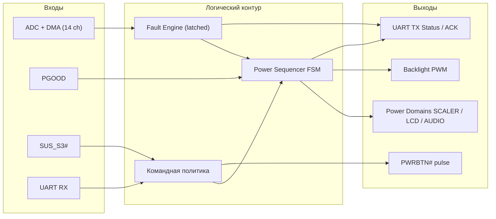
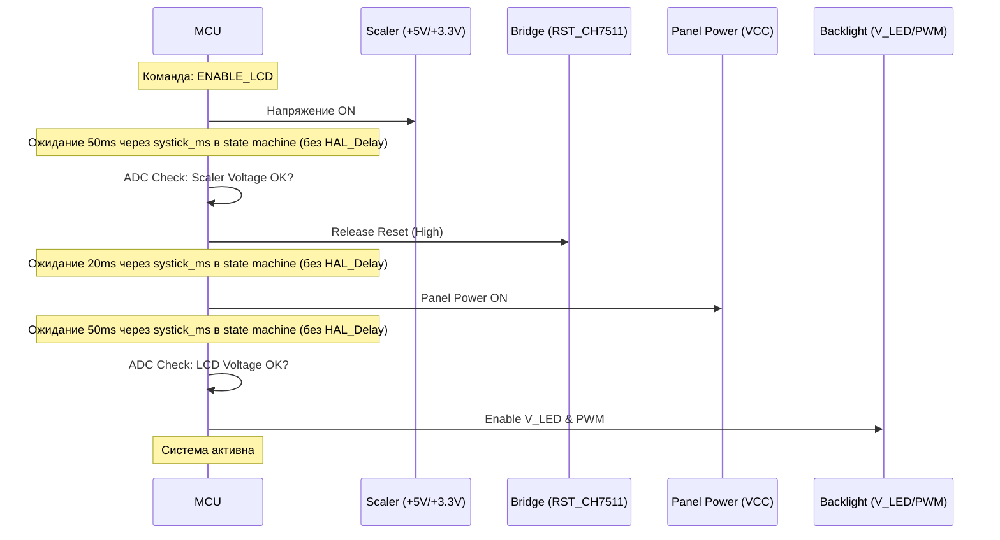
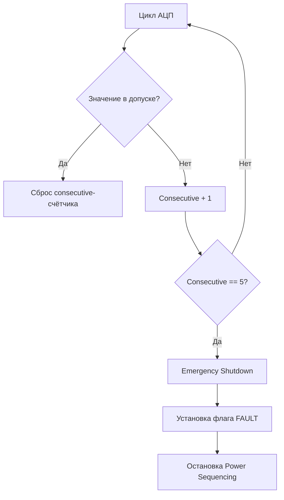
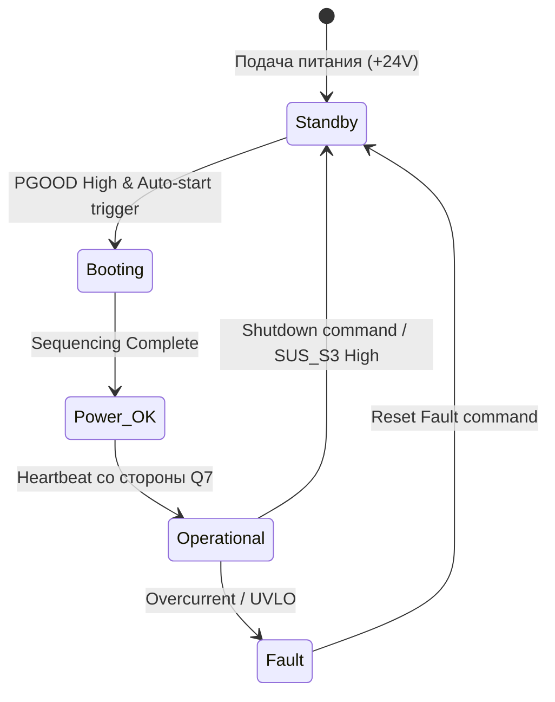

# Техническая спецификация: Контроллер управления питанием (MCU Power)

**Микроконтроллер:** STM32F030R8T6  
**Тактовая частота:** 32 МГц (внешний кварц 8 МГц + PLL)  
**Роль в системе:** Детерминированный контроллер безопасности, управления питанием (Power Sequencing) и мониторинга периферии.

---

## 1. Архитектура уровней управления

Архитектура построена как детерминированный конвейер `Input -> Decision -> Action`, где каждый уровень имеет строго ограниченную зону ответственности.  
Это нужно, чтобы выполнять секвенсы питания без гонок, удерживать безопасное состояние при fault и не нарушать UART-контракт.

### 1.1 Роли уровней и границы ответственности

| Уровень                              | Что делает                                                                                                       | Что не делает                                                     |
| :----------------------------------- | :--------------------------------------------------------------------------------------------------------------- | :---------------------------------------------------------------- |
| **Hardware Abstraction (HAL)**       | Сэмплирует 14 каналов ADC через DMA circular, читает GPIO-входы (`PGOOD`, `SUS_S3#`), выставляет GPIO/PWM-выходы | Не принимает policy-решения, не содержит логики секвенсинга       |
| **Logic Layer (FSM + Fault Engine)** | Выполняет state machine включения/выключения, проверяет пороги, подтверждает fault, переводит в safe state       | Не блокирует цикл (`HAL_Delay` запрещен), не формирует UART-кадры |
| **Communication Layer (UART0)**      | Парсит команды, валидирует CRC-8/ATM, применяет разрешенные команды, отдает `GET_STATUS`                         | Не управляет GPIO напрямую, не обходит FSM/fault-путь             |

### 1.2 Порядок выполнения в main loop

Один проход цикла выполняется в фиксированном порядке:

1. Обработка RX/TX UART-команд.
2. Обновление ADC-данных и derived метрик.
3. Шаг state machine power sequencing.
4. Шаг fault-логики и фиксация latched-флагов.
5. `IWDG refresh` в единственной точке цикла (строго после пунктов 1–4).

Такой порядок исключает рассинхронизацию телеметрии с фактическим состоянием доменов и удерживает watchdog-обслуживание в одной контрольной точке цикла.

### 1.3 Поток сигналов и решений

**Кратко:** диаграмма показывает, какие входы (ADC/PGOOD/SUS/UART) питают логику принятия решений (`Command Policy`, `Fault Engine`, `FSM`) и какие выходы формируются (`Power Domains`, `Backlight`, `PWRBTN#`, UART-статус). Стрелки отражают направление зависимости: входы влияют на логику, логика управляет доменами и формирует телеметрию.

### 1.4 Safety-правила на стыках уровней

- На старте системы до обработки любых UART-команд и до любых секвенсов **обязателен** `safe state`.
- При любом fault **обязателен** `safe state`.
- При fault порядок действий фиксированный: **сначала** перевод в `safe state`, **затем** защёлкивание `fault_flags`.
- `fault_flags` являются latched и **не сбрасываются автоматически** (только явной командой сброса fault).
- `BACKLIGHT` может быть включен только при активных `SCALER` и `LCD`.
- `GET_STATUS` всегда отражает текущее состояние доменов + latched fault без авто-сброса.
- ISR оставляются минимальными; вся логика решений выполняется в main loop.
- `IWDG refresh` выполняется ровно в одном месте main loop, строго после UART/ADC/FSM/fault; refresh запрещён из ISR, HAL callback и низкоуровневых функций периферии.

---

## 2. Алгоритм Power Sequencing (Видеоподсистема)

Для исключения повреждения LCD-панели и моста CH7511b, включение происходит по строгому графику. Любое отклонение напряжения на промежуточном этапе останавливает процесс.

Дополнительные условия безопасности по `PGOOD`:

- Запуск секвенсов (включение доменов дисплея) **запрещён**, если `PGOOD=LOW`.
- Падение `PGOOD` во время активного секвенса приводит к аварийному выключению дисплея (немедленный переход в `safe state`) и фиксации fault.

**Кратко:** это эталонный порядок включения видеотракта: сначала питание scaler, затем снятие reset с моста, затем питание панели, и только после проверок по АЦП — включение подсветки. Задержки выполняются таймерами FSM (через `systick_ms`), без блокирующих задержек.

---

## 3. Система мониторинга и защиты (Fault Engine)

Контроллер опрашивает 14 каналов АЦП. Для исключения ложных срабатываний от пусковых токов используется алгоритм фильтрации (Glitch Filter).

### 3.1 Логика обработки аварии

1.  **Сэмплирование:** Для каждого канала используется скользящее усреднение по окну **8** измерений.
2.  **Детекция:** Если усреднённое значение выходит за порог `High` или `Low`, инкрементируется счётчик **consecutive** ошибок конкретного канала.
3.  **Подтверждение fault:** Fault считается подтверждённым при **5 подряд** измерениях вне порога.
4.  **Сброс подтверждения:** Любое измерение в пределах порога **сбрасывает** consecutive-счётчик подтверждения.
5.  **Реакция:** При подтверждённом fault домен питания немедленно отключается.
6.  **Блокировка (Latch):** Состояние ошибки сохраняется до получения команды `RESET_FAULT` и не сбрасывается автоматически по нормализации измерений.

**Кратко:** алгоритм подтверждает аварию только после серии подряд выходов за порог (здесь `consecutive == 5`), чтобы отфильтровать кратковременные выбросы. При подтверждении выполняется аварийное отключение, установка latched fault и остановка секвенсинга.

---

## 4. Взаимодействие с процессорным модулем (Q7)

### 4.1 Автозапуск (Auto-Power-On)

MCU выполняет роль внешнего супервизора для модуля Q7.

- Если `PGOOD` в норме, но сигнал `SUS_S3#` остается `LOW` (процессор в сне или выключен) более 500 мс, MCU генерирует импульс `PWRBTN#` длительностью 150 мс.
- Интервал между попытками запуска — 5 секунд.

### 4.2 Протокол обмена (UART0)

Связь осуществляется кадрами фиксированной структуры. Все многобайтные поля протокола (например, `uint16`, `int16`, `uint32`) передаются в формате **Little Endian**.

- **Baudrate:** 115200, 8N1.
- **CRC:** **CRC-8/ATM** со следующими параметрами:
  - `poly=0x07`
  - `init=0x00`
  - `refin=false`
  - `refout=false`
  - `xorout=0x00`
  - Расчёт CRC выполняется строго по последовательности байт **`[CMD][LEN][DATA...]`** (поля `STX` и `ETX` в расчёт не входят).

| Byte | Field | Description                                |
| :--- | :---- | :----------------------------------------- |
| 0    | STX   | `0x02` (Start of Text)                     |
| 1    | CMD   | Код команды (напр. `0x02` - Power Control) |
| 2    | LEN   | Длина поля данных                          |
| 3..N | DATA  | Параметры команды                          |
| N+1  | CRC8  | Контрольная сумма заголовка и данных       |
| N+2  | ETX   | `0x03` (End of Text)                       |

#### 4.2.1 Телеметрия `GET_STATUS` (CMD=0x04)

- Ответ на `GET_STATUS (0x04)` **всегда** имеет `LEN=26`.
- Порядок полей в `DATA` **неизменяемый**.

Формат `DATA` для `GET_STATUS` (всего 26 байт):

| Offset | Field         | Type   | Description                                                                     |
| :----- | :------------ | :----- | :------------------------------------------------------------------------------ |
| 0      | `v24`         | int16  | Напряжение 24V (единицы и масштаб фиксируются на стороне потребителя протокола) |
| 2      | `v12`         | int16  | Напряжение 12V                                                                  |
| 4      | `v5`          | int16  | Напряжение 5V                                                                   |
| 6      | `v3v3`        | int16  | Напряжение 3.3V                                                                 |
| 8      | `i_lcd`       | int16  | Ток LCD                                                                         |
| 10     | `i_bl`        | int16  | Ток подсветки                                                                   |
| 12     | `i_scaler`    | int16  | Ток scaler                                                                      |
| 14     | `i_audio_l`   | int16  | Ток audio L                                                                     |
| 16     | `i_audio_r`   | int16  | Ток audio R                                                                     |
| 18     | `temp0`       | int16  | Температура 0 (резерв; при отсутствии датчика может быть невалидной)            |
| 20     | `temp1`       | int16  | Температура 1 (резерв; при отсутствии датчика может быть невалидной)            |
| 22     | `state`       | uint8  | Битовая маска доменов в формате `POWER_CTRL` (bits 0..6)                        |
| 23     | `fault_flags` | uint16 | Защёлкнутая (latched) маска причин fault                                        |
| 25     | `inputs`      | uint8  | Битовая маска входов (PGOOD/SUS и др.)                                          |

---

## 5. Распределение каналов АЦП и калибровка

Важной особенностью является использование внешнего источника опорного напряжения **VREF = 2500 мВ**.

Пересчёт АЦП:

- **12-bit Right alignment:** `mv = raw * 2500 / 4096`
- **12-bit Left alignment:** перед пересчётом выполнить `raw >>= 4`

Порядок сканирования ADC и соответствие `rank` ↔ `DMA index` фиксированы и не подлежат изменению.

| ADC rank | DMA index | Pin |
| :------- | :-------- | :-- |
| 1        | 0         | PA0 |
| 2        | 1         | PA1 |
| 3        | 2         | PA4 |
| 4        | 3         | PA5 |
| 5        | 4         | PA6 |
| 6        | 5         | PA7 |
| 7        | 6         | PB0 |
| 8        | 7         | PB1 |
| 9        | 8         | PC0 |
| 10       | 9         | PC1 |
| 11       | 10        | PC2 |
| 12       | 11        | PC3 |
| 13       | 12        | PC4 |
| 14       | 13        | PC5 |

**Хранение калибровки:** Константы смещения (Zero Offset) для датчиков тока хранятся во Flash по адресу `0x0800FC00`. При первом запуске или по команде `CALIBRATE`, MCU измеряет ток при выключенной нагрузке и сохраняет это значение как "ноль".

---

## 6. Режимы обновления (Bootloader)

Для обновления прошивки без вскрытия устройства реализован переход в системный Bootloader STM32:

1.  Получение команды `BOOTLOADER_ENTER` (0x08).
2.  Перевод системы в `safe state`.
3.  Отправка ACK по UART и ожидание завершения UART TX (кадр должен полностью уйти в линию).
4.  Запись "магического числа" в RAM.
5.  Программный сброс (System Reset).
6.  На раннем этапе инициализации проверка числа в RAM → переход (jump) на адрес `0x1FFF0000`.

---

## 7. Карта состояний системы (System States)

**Кратко по смыслу состояний:**
`Standby` — безопасное состояние с поданным +24V, без активного секвенсинга. При `PGOOD=High` и разрешённом автозапуске система переходит в `Booting` (выполнение power sequencing). После успешного завершения секвенса — `Power_OK`, а при появлении heartbeat от Q7 — `Operational`. Любая подтверждённая авария (например, перегрузка/UVLO) переводит систему в `Fault` до явной команды сброса fault; штатное выключение выполняется командой shutdown или при `SUS_S3=High` с возвратом в `Standby`.
