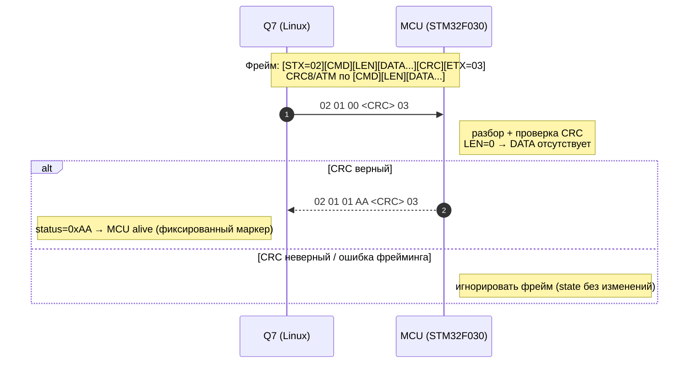
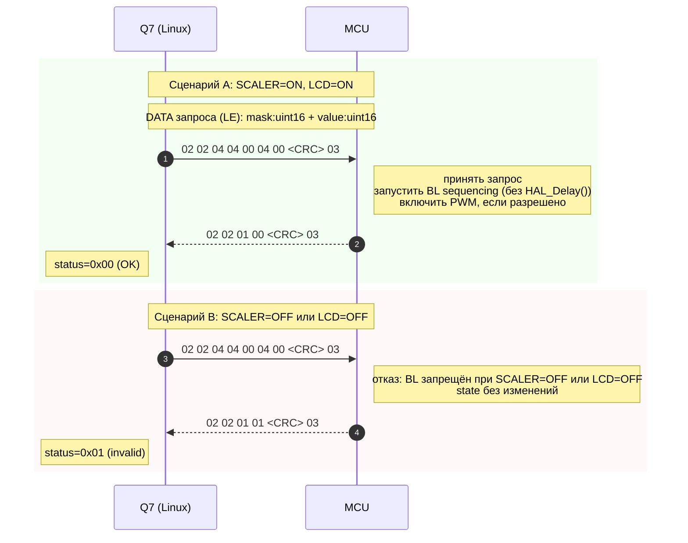
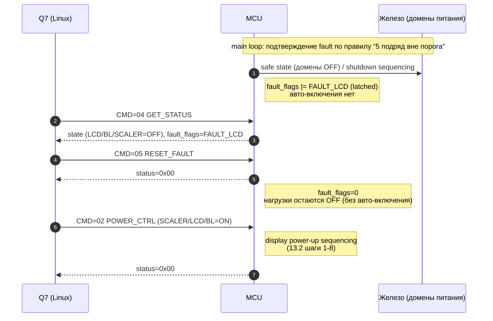
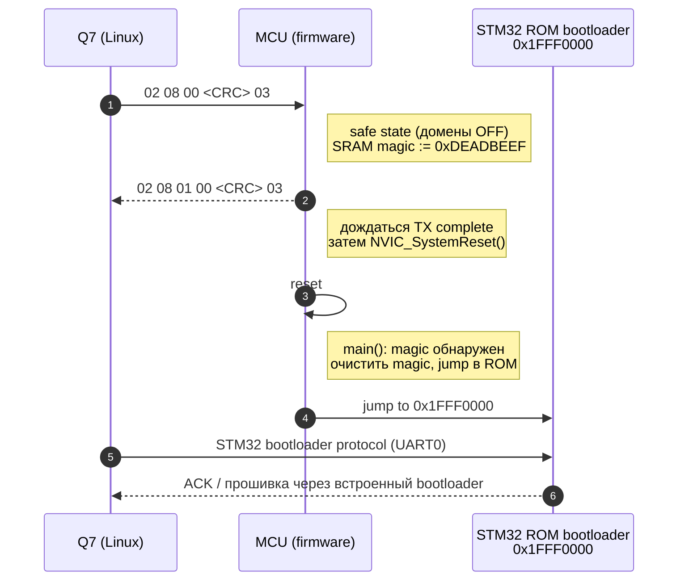
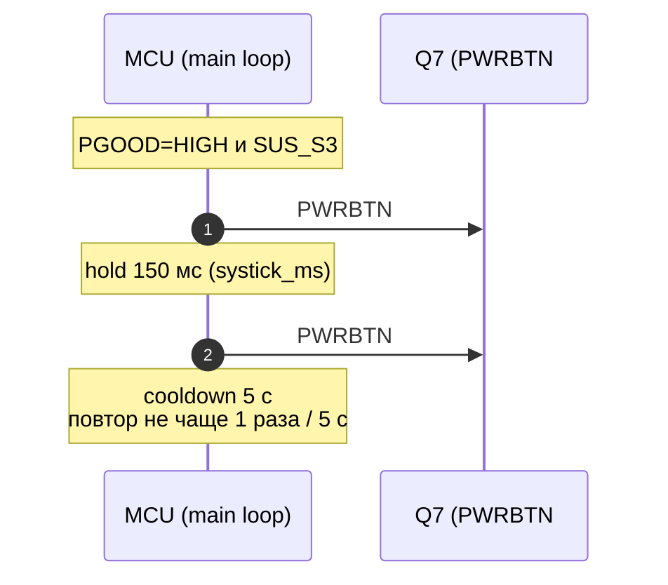

# Прошивка MCU — STM32F030R8T6 (контроллер питания)

**Инварианты см. `Rules_POWER.md`** (при любых правках сверяться с ним; при расхождении документы должны ссылаться друг на друга и приводиться к согласованию, приоритет у `Rules_POWER.md`).

## Оглавление

- [1. Назначение](#1-назначение)
- [2. Аппаратная архитектура](#2-аппаратная-архитектура)
- [3. Интерфейсы](#3-интерфейсы)
- [4. GPIO и сигналы](#4-gpio-и-сигналы)
- [5. Управление подсветкой](#5-управление-подсветкой)
- [6. Поведение системы](#6-поведение-системы)
- [7. Мониторинг и защита](#7-мониторинг-и-защита)
- [8. Управление от Q7](#8-управление-от-q7)
- [9. Протокол UART](#9-протокол-uart)
- [10. Телеметрия](#10-телеметрия)
- [11. Архитектура ПО](#11-архитектура-по)
- [12. Состояния системы](#12-состояния-системы)
- [13. Power Sequencing](#13-power-sequencing)
- [14. Калибровка](#14-калибровка)
- [17. Структура проекта](#17-структура-проекта)
- [18. Итог](#18-итог)
- [19. Что остаётся уточнить (TBD)](#19-что-остаётся-уточнить-tbd)
- [CubeMX — конфигурация проекта](#cubemx--конфигурация-проекта)
- [20. Протокол UART — фиксированные длины и примеры (рекомендуется закрепить)](#20-протокол-uart--фиксированные-длины-и-примеры-рекомендуется-закрепить)
- [20.4. Диаграммы обмена UART (Q7 ↔ MCU)](#204-диаграммы-обмена-uart-q7--mcu)
- [21. Калибровка offset во Flash — формат данных (рекомендуется закрепить)](#21-калибровка-offset-во-flash--формат-данных-рекомендуется-закрепить)

## 1. Назначение

Прошивка предназначена для микроконтроллера **STM32F030R8T6**, выполняющего функции **контроллера питания, мониторинга и безопасности** в системе с процессорным модулем Q7 (Qseven).

Для разработки прошивки используется **STM32 HAL**.

### 1.1 Примечание по совместимости (APM32)

`APM32F030R8T6` является аналогом `STM32F030R8T6`. При этом **прошивка разрабатывается и собирается под `STM32F030R8T6`** (startup/линковка/HAL/настройки периферии — как для STM32). Если на конкретной плате установлен APM32, он рассматривается как совместимая замена на уровне железа.

MCU не выполняет вычислительные задачи верхнего уровня и работает как детерминированный embedded-контроллер, обеспечивая корректную работу аппаратной части и взаимодействие с Linux на Q7.

Основные функции:

- управление включением/выключением подсистем
- контроль последовательности питания (power sequencing)
- непрерывный мониторинг токов, напряжений и температуры
- защита от аварийных режимов (КЗ, перегрузка, выход за пределы)
- обмен командами и телеметрией с Q7
- управление периферией (дисплей, аудио, Ethernet, touch)

### 1.2 Аппаратный вход в ROM-bootloader (через IC17 на стороне Q7)

По схеме (`MCU.NET`) IC17 (GPIO expander) управляет:

- `BOOT0` MCU через пин P1_1: при idle R119 = 100 Ом тянет `BOOT0` к GND; Q7 устанавливает P1_1 в HIGH → `BOOT0` = HIGH → после следующего reset MCU входит в ROM-bootloader
- `NRST` MCU через пин P1_0: Q7 может аппаратно сбросить MCU

Последовательность аппаратного входа в bootloader (со стороны Q7): P1_1 HIGH (`BOOT0`=1) → P1_0 LOW/HIGH (импульс `NRST`). Это параллельный механизм, не зависящий от состояния прошивки MCU. Firmware-механизм через SRAM magic остаётся основным штатным путём.

---

## 2. Аппаратная архитектура

### 2.1 Питание

Система содержит несколько доменов питания:

- +24V — входное питание
- +12V_A — силовая часть
- +5V_A — промежуточное питание
- +3.3V_A — питание MCU и логики

MCU питается от +3.3V_A.

### 2.2 Измерительные цепи

#### Напряжения

Измеряются через делители:

- +24V
- +12V
- +5V
- +3.3V

Номиналы делителей (по схеме PDF `MCU.SchDoc`, стр. 5):

- верхнее плечо: 4.99 kΩ (R169–R175)
- нижнее плечо: 470 Ω (R176–R182)

Коэффициент деления (напряжение на АЦП):

- \(K = \frac{470}{4990 + 470} \approx 0.0860806\)
- пример: 24 V → ~2.066 V на входе АЦП

Пересчёт (при условии, что АЦП выдаёт напряжение на входе, мВ):

- `Vin_mV = Vadcin_mV / K`
- `Vin_mV ≈ Vadcin_mV * 11.616` (для 4.99 kΩ / 470 Ω)

#### Токи

Измеряются аналоговыми датчиками тока:

- LCD
- Backlight
- Scaler
- Audio L / R

Особенности:

- аналоговый выход с offset
- требуется программная калибровка

Обвязка (по схеме PDF `MCU.SchDoc`):

- питание датчиков: +3.3V_A
- выход на АЦП: RC-фильтр 100 Ω + 1 µF (антиалиас/сглаживание)

#### Температура

- 2 канала под NTC (Temp0, Temp1) — **резерв / опционально**

Схема включения (по схеме PDF `MCU.SchDoc`):

- верхний резистор делителя: 10 kΩ (R126 / R127) к питанию
- NTC — нижнее плечо делителя (к земле)
- вход АЦП: `Temp0_M`, `Temp1_M`

Примечание:

- **На текущей ревизии устройства NTC-датчики не установлены и не используются.**
- Каналы `Temp0/Temp1` сохраняем в прошивке/протоколе как задел на будущее (если когда-нибудь будут установлены NTC).
- Пока NTC отсутствуют, пересчёт `ADC → °C` не выполняется/не используется (значения температуры в телеметрии считаются невалидными/зарезервированными).
- R126 / R127 (верхние плечи делителей NTC) подключены к шине **+2.5V** (а не +3.3V_A) — это соответствует VDDA MCU (см. раздел 2.4).

#### 2.4 Опорное напряжение АЦП (VDDA) — критично

По схеме (`MCU.NET`): MCU питает `VDDA` от **IC9 (RS3112-2.5XSF3)** — стабилизатор на **2.5 В**.

```
+2.5V net (MCU.NET):
  IC9-2  RS3112-2.5XSF3-OUT   ← выход стабилизатора
  U11-13 APM32F030R8T6-VDDA   ← опорное питание АЦП
  R126-1, R127-1               ← верхние плечи делителей NTC
```

**Последствия для прошивки (обязательно учитывать):**

- Формула raw → мВ корректна при **ADC Resolution = 12-bit** и **Data Alignment = Right**: `adc_mv = (uint32_t)adc_raw * 2500u / 4096u` (не 3300!)
  - если в CubeMX выставить **Left alignment** (для 12-bit), перед пересчётом нужно сделать `adc_raw >>= 4`, иначе мВ будут завышены в 16 раз
- Константа `ADC_VREF_MV = 2500` должна быть в `config.h`
- Измерение напряжений (24 В, 12 В, 5 В, 3.3 В через делители) — всё укладывается в диапазон 0..2.5 В, проблем нет
- Измерение токов (датчики `NSM2012` питаются от `+3.3V_A`, Voffset = 1650 мВ): при +5 А выход датчика = 2970 мВ, но АЦП клипирует на 2500 мВ; реальный максимум без клиппинга ≈ **(2500 − 1650) / 264 ≈ 3.2 А**

> Это не ошибка схемы — нагрузки на плате не превышают нескольких ампер. Просто верхнюю границу токовой защиты (`I_xxx_MAX`) выставлять не выше ~3000 мА.

---

## 3. Интерфейсы

### 3.1 UART0 (основной)

Связь с Q7 (Linux):

- приём команд управления
- передача телеметрии

#### Параметры UART0 (фиксированные)

- Baudrate: 115200
- Data bits: 8
- Parity: None
- Stop bits: 1
- Flow control: None

#### Тактирование MCU (фиксировано)

- Источник: внешний кварц `Y2` (HSE) **8 МГц**
- PLL: **используется**
- Системная частота: **SYSCLK = 32 МГц** (HSE 8 МГц × PLL x4)

Примечание:

- PLL выбран намеренно: он нужен для достаточного **throughput АЦП** (scan + DMA по множеству каналов) и при этом не мешает UART.
- тайминги UART/ADC/PWM в прошивке должны рассчитываться, исходя из **SYSCLK = 32 МГц**.

### 3.2 UART Debug

- отдельный UART для отладки
- используется по необходимости

### 3.3 I2C

- управление GPIO-экспандером (опционально)

Примечание по текущей ревизии (уточнено по `MCU.NET`):

- GPIO-экспандер **присутствует** в схеме: **IC17 = TPT29555-TS5R** (3Peak, 16-бит I2C GPIO expander)
- I2C-линии (`GP0_I2C_CLK`, `GP0_I2C_DAT`) подключены к IC17, но **не выведены на пины MCU** — мастером является **Q7 (Linux)**, не MCU
- MCU читает `IN_0..IN_5` напрямую через GPIO (PB10..PB15) — параллельно с IC17, который также подключён к этим сигналам
- IC17 управляет `NRST` и `BOOT0` MCU (пины P1_0 и P1_1): Q7 может аппаратно сбросить MCU и поднять BOOT0 через GPIO expander (см. раздел 19.5)
- **MCU не инициализирует I2C** и не взаимодействует с IC17 — это полностью на стороне Q7

---

## 4. GPIO и сигналы

### 4.0 Определения: ON/OFF и safe state

Здесь критично различать:

- **активный уровень сигнала на ноге MCU** (какой уровень на GPIO вызывает действие по железу),
- **логическое состояние функции** (**ON/OFF**),
- **safe state при старте** — состояние, при котором *ничего не включится неконтролируемо* и не произойдёт “нажатие кнопок” на Q7.

Чтобы “OFF” не трактовался двояко, ниже принято определение **по уровню на GPIO MCU**:

- Для выходов **push-pull**:
  - **active HIGH**: `ON = HIGH`, `OFF = LOW`
  - **active LOW**: `ON = LOW`, `OFF = HIGH`
- Для выходов **open-drain** (линии с `#`, reset/кнопки):
  - **assert** = тянуть в `LOW`
  - **release** = выставить “HIGH” на open-drain (фактически **Hi‑Z**, линия уходит в HIGH внешней подтяжкой)
  - безопасно на старте: **release** (не тянуть в LOW)

> Примечание про оптопары/транзисторы: на силовой/изолированной стороне логика может быть инверсной. В прошивке и в таблицах ниже **активный уровень фиксируется на пине MCU** (по net-имени и принятой логике управления).

### 4.1 Управление питанием (выходы)

Активный уровень — высокий (если не указано иное):

- SCALER_POWER_ON
- LCD_POWER_ON
- BACKLIGHT_ON
- POWER_AUDIO
- POWER_ETH_1
- POWER_ETH_2
- POWER_TOUCH

Особенности:

- управление через оптопары
- силовая часть отделена гальванически

#### 4.1.1 Режимы усилителя (не домены питания)

Сигналы `SDZ` и `MUTE` — это **режимные входы** усилителя `TPA3118D2`, а не “питание домена”. Поэтому их нельзя смешивать с `*_POWER_ON` и трактовать в терминах “ON/OFF домена”.

Активные уровни на пине MCU (push-pull):

- `SDZ` — **active HIGH**, но семантика такая:
  - `SDZ = LOW` → **shutdown** (выходы Hi‑Z)
  - `SDZ = HIGH` → **выход из shutdown** (усилитель разрешён по питанию/внутренним условиям)
- `MUTE` — **active HIGH**, семантика такая:
  - `MUTE = HIGH` → **mute** (без звука)
  - `MUTE = LOW` → **unmute** (звук разрешён)

#### Safe state при старте (минимум риска)

Безопасные значения при старте (до любого sequencing и до команд от Q7):

- Домены питания (**active HIGH**, push-pull) — **OFF = LOW**:
  - `SCALER_POWER_ON = LOW`
  - `LCD_POWER_ON = LOW`
  - `BACKLIGHT_ON = LOW`
  - `POWER_AUDIO = LOW`
  - `POWER_ETH_1 = LOW`
  - `POWER_ETH_2 = LOW`
  - `POWER_TOUCH = LOW`
- Усилитель `TPA3118D2` (это режимы, не “питание домена”; безопасно для акустики):
  - `SDZ = LOW` (**shutdown**, выходы Hi‑Z)
  - `MUTE = HIGH` (**mute**, без звука)

Важно: `SDZ`/`MUTE` — отдельные режимные входы усилителя, поэтому “OFF” для них **нельзя** понимать как “LOW”. Для старта безопасно держать усилитель в `shutdown/mute` независимо от `POWER_AUDIO`.

### 4.2 Специальные выходы (open-drain)

- RST_CH7511b — reset LVDS моста (активный LOW)
- PWRBTN# — эмуляция кнопки питания Q7 (LOW)
- RSTBTN# — эмуляция reset кнопки Q7 (LOW)

Подтяжки (по схеме PDF `Display.SchDoc`):

- `RST_CH7511b`: внешняя подтяжка к +3.3V_S через R208 = 100 kΩ (внутренняя подтяжка MCU не требуется)

### 4.3 Входные сигналы

- PGOOD — питание в норме (HIGH)
- SUS_S3# — состояние Linux (HIGH = работает)
- Faultz — состояние усилителя (LOW = ошибка)

### 4.4 Дискретные входы

- IN_0 … IN_5

Особенности:

- опторазвязка
- медленные фронты
- требуется debounce и фильтрация

Подтяжки (по схеме PDF `MCU.SchDoc`):

- `IN_0…IN_5`: внешние pull-up 10 kΩ к VMCU (R130/R137/R144/R151/R157/R166)
- рекомендуется конфигурировать входы MCU как `floating input` (без внутренних pull-up); при необходимости подавления помех допускается `input pull-down`

---

## 5. Управление подсветкой

- ШИМ: TIM17 CH1
- Частота: 200 Гц
- Управление: 0–100% (по команде от Q7)

---

## 6. Поведение системы

### 6.1 Старт системы

После подачи питания MCU:

1. Инициализирует периферию
2. Устанавливает safe state:
   - домены питания в OFF (см. раздел 4.1: для active HIGH это LOW)
   - open-drain линии “отпущены” (release, не тянуть в LOW)
   - усилитель в `shutdown/mute` (`SDZ = LOW`, `MUTE = HIGH`)
3. Ждёт `PGOOD = HIGH` (активный опрос; если не появился за 5 секунд — установить `FAULT_PGOOD_LOST` и оставаться в INIT)
4. Включает подсистемы по значениям по умолчанию:
   - `SCALER` + `LCD` — **через полный display power sequencing** (раздел 13.2, шаги 1–6); `BACKLIGHT` при старте **не включается**
   - `TOUCH` = ON (простое GPIO, без sequencing)
   - `AUDIO` = ON (питание включается, усилитель удерживается в безопасном состоянии: `SDZ = LOW`, `MUTE = HIGH`; последовательность раздела 19.6 выполняется только по команде от Q7)
   - `BACKLIGHT` = OFF

Дальнейшее управление осуществляется командами от Q7.

---

### 6.2 Контроль Linux (SUS_S3#)

MCU контролирует состояние ОС:

- SUS_S3# = HIGH → Linux работает
- SUS_S3# = LOW → Linux выключен

Если:

- PGOOD = HIGH
- SUS_S3# = LOW более 500 мс

то MCU выполняет автоматический запуск:

- формирует импульс 150 мс на `PWRBTN#` (активный LOW)
- повтор не чаще 1 раза в 5 секунд

Цель: обеспечить постоянную работу Linux.

---

### 6.3 Перезапуск LVDS моста

По команде от Q7:

- управление сигналом RST_CH7511b

---

## 7. Мониторинг и защита

MCU в непрерывном режиме:

- измеряет АЦП
- пересчитывает физические значения
- контролирует пороги

Контролируемые параметры:

- напряжения
- токи
- температура

### Аварийные условия:

- превышение тока
- превышение напряжения
- пониженное напряжение
- ошибка усилителя (Faultz)

### Реакция:

- отключение соответствующей подсистемы
- фиксация ошибки (защёлкивание fault)
- передача статуса в Q7

### АЦП: частота и режим (фиксировано)

- режим: **scan mode + DMA**, циклический буфер (ring/circular)
- каналы: все аналоговые каналы измерений читаются непрерывно
- обработка: основной цикл/логика защиты работает по данным из DMA-буфера (усреднение/пересчёт — программно)

### АЦП: список каналов, количество и порядок сканирования (критично для DMA)

В проекте **ровно 14 ADC-каналов** (аналоговые входы, перечисленные в таблице GPIO ниже). Для исключения неоднозначностей **порядок сканирования фиксируется** и считается частью контракта прошивки (DMA-буфер, структура телеметрии, фильтрация, пороговая логика).

**Константа:**

- `ADC_CHANNEL_COUNT = 14`

**Порядок сканирования (Rank 1…14) и маппинг DMA-буфера (index 0…13):**

| Rank | DMA index | MCU pin | ADC channel | Net label           | Физ. величина |
| ---- | --------- | ------- | ----------- | ------------------- | ------------- |
| 1    | 0         | PA0     | ADC_IN0     | LCD_CURRENT_M       | ток           |
| 2    | 1         | PA1     | ADC_IN1     | BACKLIGHT_CURRENT_M | ток           |
| 3    | 2         | PA4     | ADC_IN4     | SCALER_CURRENT_M    | ток           |
| 4    | 3         | PA5     | ADC_IN5     | AUDIO_L_CURRENT_M   | ток           |
| 5    | 4         | PA6     | ADC_IN6     | AUDIO_R_CURRENT_M   | ток           |
| 6    | 5         | PA7     | ADC_IN7     | LCD_POWER_M         | напряжение    |
| 7    | 6         | PB0     | ADC_IN8     | BACKLIGHT_POWER_M   | напряжение    |
| 8    | 7         | PB1     | ADC_IN9     | SCALER_POWER_M      | напряжение    |
| 9    | 8         | PC0     | ADC_IN10    | V+24_M              | напряжение    |
| 10   | 9         | PC1     | ADC_IN11    | V+12_M              | напряжение    |
| 11   | 10        | PC2     | ADC_IN12    | V+5_M               | напряжение    |
| 12   | 11        | PC3     | ADC_IN13    | V+3.3_M             | напряжение    |
| 13   | 12        | PC4     | ADC_IN14    | Temp0_M             | температура*  |
| 14   | 13        | PC5     | ADC_IN15    | Temp1_M             | температура*  |

\* `Temp0/Temp1` на текущей ревизии не используются (см. раздел 2.2), но **места в DMA-буфере и телеметрии сохраняются**, чтобы не ломать контракт.

**Следствие для кода:**

- DMA-буфер должен иметь длину **ровно 14** элементов и интерпретироваться строго по таблице выше.
- Любая смена порядка сканирования = изменение контракта и требует синхронной правки: DMA layout, фильтров, пересчёта, порогов, `GET_STATUS`.

Оценка частоты:

- при `HSI14 = 14 МГц`, `ADC sample time = 239.5 cycles` и `ADC_CHANNEL_COUNT = 14`: одна конверсия занимает \(239.5 + 12.5\) тактов, поэтому частота прохода всей последовательности \(\approx 14\,000\,000 / (239.5 + 12.5) \approx 55.6\) кГц, а **на один канал** \(\approx 55.6/14 \approx 4.0\) кГц — этого достаточно для задач защиты/телеметрии.

### Пороговые значения (по умолчанию)

- 24V: 20–26 V
- 12V: 10–13 V
- 5V: 4.5–5.5 V
- 3.3V: 3.0–3.6 V

Пороги по току/напряжению/прочим каналам:

- в прошивке есть **дефолтные значения** (стартовые, “чтобы работало”)
- **финальные значения определяются натурно на устройстве**
- должны быть **изменяемы из Linux командой по UART** (без перепрошивки)

Рекомендуемые дефолты для прошивки (мВ/мА), которые можно “зашить” в `config.h` и затем менять через `SET_THRESHOLDS`:

```
// Напряжения (мВ)
#define V24_MIN 20000u
#define V24_MAX 26000u
#define V12_MIN 10000u
#define V12_MAX 13000u
#define V5_MIN   4500u
#define V5_MAX   5500u
#define V33_MIN  3000u
#define V33_MAX  3600u

// Токи (мА) — стартовые “разумные” значения; финальные подбираются натурно
#define I_LCD_MAX       2000u   // 2 A
#define I_BACKLIGHT_MAX 3000u   // 3 A
#define I_SCALER_MAX    1500u
#define I_AUDIO_L_MAX    800u
#define I_AUDIO_R_MAX    800u
```

### Фильтрация аварий

- скользящее окно: 8 измерений
- подтверждение аварии: **5 последовательных измерений подряд** с превышением порога/выходом за пределы

Правило:

- любое измерение в норме **сбрасывает** счётчик подтверждения (consecutive counter), окно 8 используется только как база для усреднения/фильтрации измерений, а не как критерий “5 из 8”.

### Faultz

- активный LOW
- проверяется в реальном времени и участвует в логике аварии
- считается ошибкой после подтверждения (например, 5 выборок)
- при подтверждении влияет на `fault_flags` и переводит систему/канал в защитное отключение

### Политика fault (важно)

- **Срабатывание защиты отключает соответствующую нагрузку/подсистему, чтобы ничего не сгорело.**
- **Fault защёлкивается**: автоматического повторного включения нет.
- **Повторное включение — только по явной команде от Linux** (сброс fault + разрешение включения).

---

## 8. Управление от Q7

Linux может:

- включать/выключать питание подсистем
- изменять яркость подсветки
- запрашивать телеметрию
- считывать состояния входов
- перезапускать MCU
- переводить MCU в bootloader (для обновления)

Используется встроенный загрузчик MCU.

---

## 9. Протокол UART

### Формат пакета

```
[STX][CMD][LEN][DATA][CRC][ETX]
```

- STX = 0x02
- ETX = 0x03
- LEN — длина только DATA (в байтах), 0..255
- CRC — CRC8 по `[CMD][LEN][DATA...]`

### Endianness и масштабирование

- порядок байт: Little Endian
- напряжение: мВ
- ток: мА
- температура: 0.1°C (например, 253 = 25.3°C)
- PWM/яркость: 0–1000 (соответствует 0–100%)

Типы данных:

- `uint8_t`
- `uint16_t`
- `uint32_t`
- `int16_t` (температуры; токи при необходимости)

### CRC8

CRC-8/ATM:

- Polynomial: 0x07
- Init: 0x00
- RefIn: false
- RefOut: false
- XorOut: 0x00

### Фрейминг и обработка ошибок

- экранирование не используется
- при получении `0x02` — начало нового пакета (сброс текущего состояния парсера)
- при получении `0x03` — завершение пакета
- при невалидной структуре — пакет отбрасывается

Таймауты:

- межбайтовый: 10 мс
- общий таймаут пакета: 50 мс

Ошибки:

- CRC error → пакет игнорируется
- неизвестный `CMD` → ответ NACK

### Формат ответов (ACK/NACK)

Принято единообразно для всех команд:

- успешное выполнение команды → ответный пакет с тем же `CMD` и `DATA = uint8_t status = 0x00`
- ошибка выполнения/некорректные параметры → ответный пакет с тем же `CMD` и `DATA = uint8_t status = 0x01`
- неизвестная команда → **NACK**: ответный пакет с `CMD = 0xFF` и `DATA = uint8_t error_code`

Исключение:

- `PING (0x01)` в ответе возвращает `uint8_t status = 0xAA` как фиксированный маркер “MCU alive”

`error_code` (минимум):

- `0x01` = unknown command

### Команды (коды)

| Команда          | Код  |
| ---------------- | ---- |
| PING             | 0x01 |
| POWER_CTRL       | 0x02 |
| SET_BRIGHTNESS   | 0x03 |
| GET_STATUS       | 0x04 |
| RESET_FAULT      | 0x05 |
| RESET_BRIDGE     | 0x06 |
| SET_THRESHOLDS   | 0x07 |
| BOOTLOADER_ENTER | 0x08 |
| CALIBRATE_OFFSET | 0x09 |

### Форматы DATA

#### PING (0x01)

Request: пусто

Response:

- `uint8_t status = 0xAA`

#### POWER_CTRL (0x02)

Request:

- `uint16_t mask`
- `uint16_t value`

`mask` — какие домены изменяем, `value` — значения (1=ON, 0=OFF).

Биты:

| Бит | Сигнал    |
| --- | --------- |
| 0   | SCALER    |
| 1   | LCD       |
| 2   | BACKLIGHT |
| 3   | AUDIO     |
| 4   | ETH1      |
| 5   | ETH2      |
| 6   | TOUCH     |

Ответ:

- `uint8_t status`:
  - `0` = OK
  - `1` = invalid request

Правила (важно для `BACKLIGHT`):

- изменение `BACKLIGHT` выполняется **только** через полный power sequencing дисплея (см. раздел 13), а не простым дёрганием GPIO
- если запрошено `BACKLIGHT = ON`, но `SCALER` или `LCD` сейчас выключены — команда считается некорректной, возвращать `status = 1` и состояние не менять

#### SET_BRIGHTNESS (0x03)

Request:

- `uint16_t pwm` (0..1000)

Семантика `pwm`:

- `0` = подсветка выключена (0%)
- `1000` = максимальная яркость (100%)

Важно: выход PWM для подсветки должен быть **неинвертированный** (TIM17 CH1 `OC Polarity = High / Active High`).
Если выставить `Active Low`, PWM инвертируется и получится “0% = полная подсветка”, что ломает логику команды.

#### GET_STATUS (0x04)

Response:

```
struct {
    uint16_t v24;
    uint16_t v12;
    uint16_t v5;
    uint16_t v3v3;

    uint16_t i_lcd;
    uint16_t i_backlight;
    uint16_t i_scaler;
    uint16_t i_audio_l;
    uint16_t i_audio_r;

    int16_t temp0;
    int16_t temp1;

    uint8_t state;
    uint16_t fault_flags;
    uint8_t inputs;
}
```

`state`:

- битовая маска включённых доменов питания **в том же формате**, что и `POWER_CTRL` (bits 0..6: `SCALER`, `LCD`, `BACKLIGHT`, `AUDIO`, `ETH1`, `ETH2`, `TOUCH`)

`fault_flags`:

- 16-битная защёлкнутая маска fault-причин (битовая карта и политика отключения доменов — см. раздел 19.4)

`inputs`:

- bit0..5 = IN_0..IN_5
- bit6 = PGOOD
- bit7 = Faultz

#### RESET_FAULT (0x05)

Request: пусто

Действие:

- очистка `fault_flags` (снятие защёлкнутого fault)
- после `RESET_FAULT` повторное включение доменов выполняется **только** через явный `POWER_CTRL` (ничего не включается “само”).

#### RESET_BRIDGE (0x06)

Request: пусто

Действие: импульс на `RST_CH7511b` (LOW 10 мс).

#### SET_THRESHOLDS (0x07)

Назначение: изменить **пороговые значения защит** в рантайме по команде от Linux (без перепрошивки). Дефолтные пороги прошивки должны быть адекватными, а финальные — подбираются натурно на устройстве.

Request (фиксированный формат, Little Endian):

```
uint16_t mask;          // биты: какие пороги меняем
// затем — только те значения, которые отмечены в mask, в следующем порядке:
uint16_t v24_min,  v24_max;
uint16_t v12_min,  v12_max;
uint16_t v5_min,   v5_max;
uint16_t v3v3_min, v3v3_max;
uint16_t i_lcd_max;
uint16_t i_bl_max;
uint16_t i_scaler_max;
uint16_t i_audio_l_max;
uint16_t i_audio_r_max;
```

Единицы измерения:

- напряжения: мВ
- токи: мА

Биты `mask` (закреплено):

- bit0: `V24_MIN/V24_MAX` (2× `uint16_t`)
- bit1: `V12_MIN/V12_MAX` (2× `uint16_t`)
- bit2: `V5_MIN/V5_MAX` (2× `uint16_t`)
- bit3: `V3V3_MIN/V3V3_MAX` (2× `uint16_t`)
- bit8: `I_LCD_MAX` (1× `uint16_t`)
- bit9: `I_BACKLIGHT_MAX` (1× `uint16_t`)
- bit10: `I_SCALER_MAX` (1× `uint16_t`)
- bit11: `I_AUDIO_L_MAX` (1× `uint16_t`)
- bit12: `I_AUDIO_R_MAX` (1× `uint16_t`)

Response:

- `uint8_t status`:
  - `0` = OK
  - `1` = invalid mask/value

Правила валидации (минимум):

- `mask` не должен содержать неизвестных битов
- для напряжений: `min < max` и значения в разумном диапазоне (чтобы отсеять мусор/битые пакеты)
- для токов: `max > 0` и значения в разумном диапазоне (с учётом датчика ±5 А)

#### BOOTLOADER_ENTER (0x08)

Назначение: перевести MCU в **системный ROM-bootloader** для обновления прошивки из Linux по `UART0`, без аппаратного BOOT0.

Request: пусто

Действие MCU при получении команды:

1. Перевести все выходы/домены в безопасное состояние (выключить нагрузки; не включать ничего автоматически).
2. Записать в SRAM magic-значение (например, `0xDEADBEEF` по фиксированному адресу, например `0x20000000`).
3. Выполнить `NVIC_SystemReset()`.

Действие MCU после reset в `main()`:

- если magic-значение обнаружено, очистить его и выполнить jump в системный bootloader ROM (для `STM32F030`: базовый адрес системной памяти **`0x1FFF0000`**).

Примечание:

- аппаратный вариант через BOOT0 возможен только если BOOT0 реально выведен/управляем, но в рамках предоставленных файлов это не подтверждено; поэтому базовым считается сценарий через SRAM magic + jump.

#### CALIBRATE_OFFSET (0x09)

Назначение: runtime-калибровка **offset (0 A)** для датчиков тока.

Request: пусто

Действие:

- при получении команды измерить текущие значения АЦП токовых каналов как “0 A”
- сохранить offset в энергонезависимой памяти (flash-эмуляция)

Хранение в Flash (фиксировано для `STM32F030R8T6`):

- Flash: 64 КБ, размер страницы: 1 КБ
- под калибровку резервируется **последняя страница**: адрес **`0x0800FC00`**
- в данных хранить значения offset + CRC для валидации при старте

Response:

- `uint8_t status` (0 = OK, 1 = error)

---

## 10. Телеметрия

Передаётся по запросу:

- напряжения (+24, +12, +5, +3.3)
- токи (LCD, Backlight, Scaler, Audio)
- температуры
- состояние системы
- флаги ошибок
- состояния входов (IN_x, PGOOD, Faultz, SUS_S3#)

---

## 11. Архитектура ПО

Основные модули:

- HAL
- Power Manager
- ADC Service
- UART Service
- Fault Manager
- State Machine

### Основной цикл

```
while (1) {
    process_uart();
    read_adc();
    update_state();
    handle_faults();
    watchdog_refresh();
}
```

---

## 12. Состояния системы

- OFF — всё выключено
- INIT — инициализация
- POWER_UP — включение питания
- RUN — нормальная работа
- FAULT — авария
- SHUTDOWN — корректное выключение

---

## 13. Power Sequencing

### 13.1 Предусловия

Перед запуском любого display power sequencing (включение или выключение):

- `PGOOD` должен быть `HIGH`.
- Если `PGOOD` = LOW — запуск секвенса запрещён, вернуть `status = 1` на команду инициатора.
- Если `PGOOD` падает в процессе секвенса — немедленно прервать, перейти в аварийное выключение (BACKLIGHT_OFF → LCD_OFF → RST_LOW → SCALER_OFF без задержек), зафиксировать `fault_flags`.

### 13.2 Последовательность включения дисплея

```
1.  SCALER_POWER_ON = HIGH
2.  wait 50 ms
    → проверить SCALER_POWER_M (ADC_IN9 / PB1) > порога (см. ниже)
    → если таймаут 200 мс истёк и напряжение не появилось → fault, abort
3.  RST_CH7511b = HIGH (release, open-drain отпускает)
4.  wait 20 ms
5.  LCD_POWER_ON = HIGH
6.  wait 50 ms
    → проверить LCD_POWER_M (ADC_IN7 / PA7) > порога
    → если таймаут 200 мс истёк и напряжение не появилось → fault, abort
7.  BACKLIGHT_ON = HIGH
8.  PWM start (TIM17, целевое значение brightness)
    → проверить BACKLIGHT_POWER_M (ADC_IN8 / PB0) > порога
    → если таймаут 200 мс истёк и напряжение не появилось → fault, abort
```

Пороги напряжений для подтверждения включения (рекомендуемые, в мВ, подбираются натурно):

| Канал             | ADC-пин     | Минимальный порог |
| ----------------- | ----------- | ----------------- |
| SCALER_POWER_M    | PB1/ADC_IN9 | 4000 мВ (≈5V)     |
| LCD_POWER_M       | PA7/ADC_IN7 | 2800 мВ (≈3.3V)   |
| BACKLIGHT_POWER_M | PB0/ADC_IN8 | 9000 мВ (≈12V)    |

Константы в `config.h`:

```c
#define SEQ_SCALER_VOLTAGE_MIN_MV    4000u
#define SEQ_LCD_VOLTAGE_MIN_MV       2800u
#define SEQ_BACKLIGHT_VOLTAGE_MIN_MV 9000u
#define SEQ_VOLTAGE_TIMEOUT_MS       200u
```

### 13.3 Последовательность выключения дисплея

```
1.  PWM = 0
2.  wait 10 ms
3.  BACKLIGHT_ON = LOW
4.  wait 20 ms
5.  LCD_POWER_ON = LOW
6.  wait 20 ms
7.  RST_CH7511b = LOW  (open-drain тянет к земле)
8.  SCALER_POWER_ON = LOW
```

Примечание: во время выключения проверка АЦП не выполняется — секвенс всегда доводится до конца.

### 13.4 eDP / LVDS мост CH7511b

`CH7511b` преобразует eDP (от скалера) в LVDS (к матрице).

- **HPD (Hot Plug Detect)** eDP-интерфейса к MCU **не подключён** и MCU его **не мониторит** — это сигнал между скалером и CH7511b, MCU не участвует.
- MCU управляет только `RST_CH7511b` (PB8, open-drain).
- `RST_CH7511b` = LOW удерживает мост в сбросе; HIGH — нормальная работа.
- Шаг 3 включения (`RST_CH7511b = HIGH`) выполняется **до** включения LCD, чтобы мост успел инициализироваться пока матрица ещё не запитана.
- Команда `RESET_BRIDGE (0x06)` — это отдельный runtime-сброс: импульс LOW 10 мс → HIGH; не является power sequencing и выполняется только при уже включённом дисплее (SCALER=ON, LCD=ON).

### 13.5 Реализация: state machine (без блокирующих delay)

Секвенс реализуется через state machine в основном цикле. Никаких `HAL_Delay` или `osDelay`.

Состояния включения (`DISPLAY_SEQ_UP`):

```
SEQ_UP_IDLE
SEQ_UP_SCALER_ON       → assert SCALER_POWER_ON, запустить таймер 50 мс
SEQ_UP_WAIT_SCALER     → ждать таймер; параллельно проверять ADC SCALER_POWER_M
SEQ_UP_RST_RELEASE     → assert RST_CH7511b HIGH, запустить таймер 20 мс
SEQ_UP_WAIT_RST        → ждать таймер 20 мс
SEQ_UP_LCD_ON          → assert LCD_POWER_ON, запустить таймер 50 мс
SEQ_UP_WAIT_LCD        → ждать таймер; параллельно проверять ADC LCD_POWER_M
SEQ_UP_BACKLIGHT_ON    → assert BACKLIGHT_ON, запустить PWM, запустить таймер ADC
SEQ_UP_VERIFY_BL       → проверять ADC BACKLIGHT_POWER_M до подтверждения или таймаута
SEQ_UP_DONE
```

Состояния выключения (`DISPLAY_SEQ_DOWN`):

```
SEQ_DOWN_IDLE
SEQ_DOWN_PWM_ZERO      → PWM = 0, запустить таймер 10 мс
SEQ_DOWN_WAIT_PWM      → ждать таймер 10 мс
SEQ_DOWN_BL_OFF        → assert BACKLIGHT_ON = LOW, запустить таймер 20 мс
SEQ_DOWN_WAIT_BL       → ждать таймер 20 мс
SEQ_DOWN_LCD_OFF       → assert LCD_POWER_ON = LOW, запустить таймер 20 мс
SEQ_DOWN_WAIT_LCD      → ждать таймер 20 мс
SEQ_DOWN_RST_ASSERT    → assert RST_CH7511b = LOW
SEQ_DOWN_SCALER_OFF    → assert SCALER_POWER_ON = LOW
SEQ_DOWN_DONE
```

Таймер реализуется через глобальный `systick_ms` (инкрементируется в SysTick_Handler), сохраняется `seq_start_ms` при входе в состояние.

### 13.6 Интеграция с запуском системы (раздел 6.1)

При старте после `PGOOD = HIGH` MCU **запускает display power-up sequencing** (шаги 1–6 раздела 13.2) автоматически:

- Scaler, RST_CH7511b, LCD включаются через полный секвенс.
- `BACKLIGHT` по умолчанию **остаётся OFF** — шаги 7–8 **не выполняются** при старте.
- Состояние `power_state.backlight = OFF` сохраняется до команды от Linux.

Это значит, что после старта:

```
power_state: SCALER=ON, LCD=ON, BACKLIGHT=OFF, TOUCH=ON, AUDIO=ON (усилитель mute/sdz safe)
```

### 13.7 Интеграция с POWER_CTRL (0x02)

#### BACKLIGHT = ON

Условие: `SCALER = ON` И `LCD = ON` (уже включены и секвенс завершён).

Действие: выполнить только последнюю часть секвенса:

```
1. BACKLIGHT_ON = HIGH
2. PWM start (текущее значение brightness)
3. Проверить BACKLIGHT_POWER_M > порога (таймаут 200 мс → fault)
```

Если `SCALER = OFF` или `LCD = OFF` — вернуть `status = 1`, состояние не менять.

#### BACKLIGHT = OFF

Действие: выполнить только первую часть shutdown:

```
1. PWM = 0
2. wait 10 мс
3. BACKLIGHT_ON = LOW
```

SCALER и LCD остаются включёнными.

#### SCALER = OFF или LCD = OFF при BACKLIGHT = ON

MCU **обязан** сначала выполнить полный shutdown sequencing (шаги 1–8 раздела 13.3), а уже потом — применить запрошенные изменения. Прямое отключение SCALER или LCD при включённой подсветке запрещено.

#### SCALER = ON (при SCALER = OFF)

Запустить полный секвенс включения без BACKLIGHT (шаги 1–6 раздела 13.2).

#### LCD = ON (при LCD = OFF, если SCALER = ON)

Запустить частичный секвенс с RST:

```
1. RST_CH7511b = HIGH (release)
2. wait 20 мс
3. LCD_POWER_ON = HIGH
4. wait 50 мс + проверить ADC LCD_POWER_M
```

#### LCD = ON (при SCALER = OFF)

Вернуть `status = 1` — LCD не может быть включён без Scaler.

---

## 14. Калибровка

### Токи

- offset (ноль)
- коэффициент усиления

Примечание: для расчёта физического тока требуются параметры датчика `NSM2012-05B3R-DSPR` (Voffset и чувствительность, мВ/А) или заводская калибровка.

### Напряжения

- коэффициенты делителей

По умолчанию для каналов напряжения используется делитель 4.99 kΩ / 470 Ω (см. раздел 2.2).

---

## 17. Структура проекта

```
/project
 ├── Core/
 ├── Drivers/
 ├── Services/
 ├── Protocol/
 ├── Config/
```

---

## 17.1 Сборка и прошивка (как воспроизвести результат)

Цель этого раздела — чтобы любой разработчик мог **собрать** и **прошить** MCU без “магии” и догадок.

### Генерация проекта в STM32CubeMX (зафиксировано)

- **STM32CubeMX**: **6.17.0**
- **STM32CubeF0 (HAL package)**: **V1.11.6 (30-January-2026)**
- **MCU**: `STM32F030R8Tx`
- **Clock tree / периферия**: см. `STM32CubeMXConfig.md`.
- **Code Generator**:
  - **используется: Makefile (GNU Tools for STM32)** (сборка вне IDE, удобно в Cursor/VSCode)

> Важно: при любом обновлении `.ioc` нужно заново сгенерировать код из CubeMX. Изменения в `Core/Src`/`Core/Inc` вносятся уже после генерации.
>
> Важно: сгенерированные файлы правим только в секциях `/* USER CODE BEGIN */ ... /* USER CODE END */`, а любые изменения конфигурации периферии делаем через `.ioc` (иначе изменения потеряются при следующей генерации).

### Сборка (GNU Arm Embedded Toolchain)

- **Toolchain**:
  - `arm-none-eabi-gcc`: зафиксировать по месту выводом `arm-none-eabi-gcc --version`
  - `STM32CubeMX`: **6.17.0**
  - `STM32CubeIDE`: опционально (если используется для сборки/отладки)
- **Команда сборки**:
  - если проект сгенерирован как **Makefile**:

```bash
make -j
```

  - Артефакты (типовые имена CubeMX/Makefile; фактические пути зафиксировать в репозитории):
    - `.elf`: `build/<project>.elf` или `<project>.elf`
    - `.bin`: `build/<project>.bin` или `<project>.bin`
    - `.hex`: `build/<project>.hex` или `<project>.hex`
- **Проверка частот**: сборка должна соответствовать `SYSCLK = 32 МГц` (см. раздел 3.1).

### Прошивка (SWD)

- **Интерфейс**: SWD (`PA13/PA14`), `NRST` доступен.
- **Инструмент (зафиксировано)**: **OpenOCD + ST‑Link**

#### Пример (OpenOCD + ST‑Link)

```bash
# адаптировать путь к .elf при необходимости
openocd -f interface/stlink.cfg -f target/stm32f0x.cfg \
  -c "init; reset halt; program <project>.elf verify reset exit"
```

### Что передаётся разработчику для прошивки (контракт)

Минимальный набор, чтобы разработчик мог прошить без CubeMX:

- **`<project>.elf`** — артефакт для прошивки через OpenOCD (команда выше)
- **краткая инструкция**: 1 команда OpenOCD (см. выше) и указание, что интерфейс — ST‑Link по SWD

#### Рекомендуемый “релизный” формат (чтобы ничего не искать)

Перед передачей разработчику сформировать в репозитории папку `release/` и положить туда **один** файл с фиксированным именем:

- `release/firmware.elf`

Тогда команда прошивки становится неизменной:

```bash
openocd -f interface/stlink.cfg -f target/stm32f0x.cfg \
  -c "init; reset halt; program release/firmware.elf verify reset exit"
```

Если разработчик будет **собирать сам**, тогда дополнительно передать:

- `.ioc` (CubeMX) + весь репозиторий исходников

### Option Bytes / настройки (TBD, если понадобится)

Если для устройства критичны `BOR`, `IWDG` (hardware/software), `RDP` — зафиксировать здесь конкретные значения.

---

## 18. Итог

Прошивка реализует контроллер питания, который:

- обеспечивает корректную последовательность включения
- защищает систему от аварий
- предоставляет телеметрию
- поддерживает управление со стороны Linux

Система ориентирована на надёжность и предсказуемое поведение.

---

## 19. Что остаётся уточнить (TBD)

Ниже — ответы на вопросы из этого раздела (по `README.md`, схеме `CIS_metro.PDF` и даташитам компонентов там, где параметры не указаны явно в проектной документации). Часть пунктов (пороговые значения и политики обработки аварий) — **решения уровня прошивки** и должны быть закреплены в `config.h`/логике state machine.

### 19.1 Параметры `NSM2012-05B3R-DSPR` (датчики тока)

Датчик тока Hall-эффекта (NOVOSENSE), выход — **ratiometric** относительно питания.

| Параметр | Значение |
| --- | --- |
| Voffset (выход при 0 А) | `Vcc / 2` = **1650 мВ** (при +3.3V_A) |
| Чувствительность | **264 мВ/А** |
| Диапазон | **±5 А** |
| Точность | ±2.5 % |
| Линейность | ±0.2 % |
| Полоса | DC–400 кГц |
| Обвязка на выходе | RC-фильтр 100 Ω + 1 µF (антиалиас) |

**Диапазон выходного напряжения при ±5 А** (при питании 3.3 В):

- максимум (+5 А): `1650 + 264 × 5 = 2970 мВ`
- минимум (−5 А): `1650 − 264 × 5 = 330 мВ`

Оба значения укладываются в диапазон АЦП 0–3300 мВ.

**Voffset — ratiometric**, зависит от реального напряжения питания датчика (`Vcc/2`). При гуляющем +3.3V_A offset также смещается. Поэтому offset калибруется через команду `CALIBRATE_OFFSET (0x09)`: при нулевом токе Linux снимает текущие значения АЦП и сохраняет их во flash как откалиброванный offset. При старте прошивка читает offset из flash (проверка CRC), при невалидных данных — дефолт 1650 мВ.

**Чувствительность** — типовое значение из даташита, разброс ±2.5 %. Коэффициент `gain` также подлежит калибровке натурно на устройстве.

**Ограничение по VDDA = 2.5 В**: при питании датчика от +3.3V_A (Voffset = 1650 мВ) АЦП клипирует выход на 2500 мВ. Максимально измеримый ток без клиппинга: `(2500 − 1650) / 264 ≈ 3.2 А`. Пороги `I_xxx_MAX` должны быть выставлены не выше **3000 мА**.

Формула пересчёта (мВ → мА):

```c
// adc_mV — напряжение на входе АЦП в мВ
// Voffset_mV — откалиброванный offset (по умолчанию 1650)
// Результат знаковый: знак = направление тока
int16_t current_mA = (int32_t)(adc_mV - Voffset_mV) * 1000 / 264;
```

Константы для `config.h`:

```c
#define ADC_VREF_MV                   2500    // VDDA от IC9 (RS3112-2.5XSF3); не менять без ревизии схемы
#define CURRENT_SENSITIVITY_UV_PER_A  264000  // 264 мВ/А = 264000 мкВ/А
#define CURRENT_VOFFSET_MV_DEFAULT    1650    // Vcc/2 при +3.3V_A; уточняется калибровкой
```

### 19.2 Тип NTC для `Temp0/Temp1`

**На текущем устройстве датчиков температуры (NTC) нет и не будет** (на данной ревизии/в текущем составе). Каналы `Temp0/Temp1` считаются резервом “на будущее”, поэтому:

- тип/номинал NTC сейчас **не определяем**
- защита по температуре сейчас **не используется**
- значения `temp0/temp1` в телеметрии — **зарезервированы/невалидны** до появления реальных датчиков

Фиксация для протокола (`GET_STATUS`):

- если NTC отсутствуют, возвращать:
  - `temp0 = temp1 = -32768` (специальное значение “не используется/невалидно”)

### 19.3 Пороги по току для каналов (LCD, Backlight, Scaler, Audio L/R)

Пороги защиты (включая токи по каналам) задаются:

- **дефолтами в прошивке** (стартовые значения)
- **уточняются натурно** на устройстве
- **должны быть изменяемы из Linux по команде** (см. `SET_THRESHOLDS`)

Важно учитывать текущую цифровую фильтрацию (см. раздел 7):

- окно: 8 измерений
- подтверждение аварии: 5 подряд превышений/выходов за пределы

Рекомендуемые дефолтные пороги токов (мА) для стартовой прошивки (финальные подбираются натурно и/или через `SET_THRESHOLDS`):

- `I_LCD_MAX = 2000`
- `I_BACKLIGHT_MAX = 3000`
- `I_SCALER_MAX = 1500`
- `I_AUDIO_L_MAX = 800`
- `I_AUDIO_R_MAX = 800`

### 19.4 Политика `fault_flags`

В аппаратной документации политика `fault_flags` **не описана** — это решение прошивки.

Принятое поведение:

- **latched**: флаги защёлкиваются до команды `RESET_FAULT (0x05)`
- автоматического снятия fault/таймера выдержки **не требуется**
- повторное включение после `RESET_FAULT` выполняется **только** по явному запросу от Linux (`POWER_CTRL`)

#### 19.4.1 Битовая карта `fault_flags` (контракт MCU ↔ Linux)

`fault_flags` — это **16-битная защёлкнутая** маска причин, почему MCU перевёл систему/домен в защитное отключение или запретил включение.

Требование к использованию:

- Linux **не интерпретирует** `fault_flags` “в целом”, а опирается на **конкретные биты** ниже.
- Любая смена смысла бита = смена протокольного контракта.

Биты (LSB=bit0):

| Бит | Имя                   | Когда устанавливается (суть) |
| --- | ---------------------- | ---------------------------- |
| 0   | `FAULT_SCALER`         | Авария, связанная с доменом `SCALER` (перегрузка по току `I_SCALER_MAX` **или** не поднялось напряжение `SCALER_POWER_M` в секвенсе/таймаут). |
| 1   | `FAULT_LCD`            | Авария домена `LCD` (перегрузка по току `I_LCD_MAX` **или** не поднялось напряжение `LCD_POWER_M` в секвенсе/таймаут). |
| 2   | `FAULT_BACKLIGHT`      | Авария домена `BACKLIGHT` (перегрузка по току `I_BACKLIGHT_MAX` **или** не поднялось напряжение `BACKLIGHT_POWER_M` в секвенсе/таймаут). |
| 3   | `FAULT_AUDIO`          | Авария аудио: перегрузка `I_AUDIO_L_MAX` и/или `I_AUDIO_R_MAX` **или** вход `Faultz` (усилитель) подтверждён как fault. |
| 4   | `FAULT_ETH1`           | Авария домена `ETH1` (если добавится мониторинг/порог по току/напряжению для ETH1). Пока — резерв, но бит закреплён. |
| 5   | `FAULT_ETH2`           | Авария домена `ETH2` (если добавится мониторинг/порог по току/напряжению для ETH2). Пока — резерв, но бит закреплён. |
| 6   | `FAULT_TOUCH`          | Авария домена `TOUCH` (если добавится мониторинг/порог по току/напряжению для TOUCH). Пока — резерв, но бит закреплён. |
| 7   | `FAULT_PGOOD_LOST`     | `PGOOD` стал LOW (после подтверждения) в состоянии, где питание/секвенс активны. |
| 8   | `FAULT_AMP_FAULTZ`     | `Faultz` усилителя (PC7, active LOW) подтверждён как fault. |
| 9   | `FAULT_V24_RANGE`      | `+24V` вышло за пороги (`V24_MIN..V24_MAX`) после подтверждения. |
| 10  | `FAULT_V12_RANGE`      | `+12V` вышло за пороги (`V12_MIN..V12_MAX`) после подтверждения. |
| 11  | `FAULT_V5_RANGE`       | `+5V` вышло за пороги (`V5_MIN..V5_MAX`) после подтверждения. |
| 12  | `FAULT_V3V3_RANGE`     | `+3.3V` вышло за пороги (`V33_MIN..V33_MAX`) после подтверждения. |
| 13  | `FAULT_SEQ_ABORT`      | Секвенс дисплея был принудительно прерван (например, из-за `PGOOD`/диапазона питания) и выполнено аварийное выключение. |
| 14  | `FAULT_INTERNAL`       | Внутренняя ошибка логики (недопустимое состояние state machine, невозможность выполнить команду, и т.п.) — только если это приводит к защитному отключению. |
| 15  | `FAULT_RESERVED`       | Зарезервировано (должно передаваться как 0). |

Примечания:

- `FAULT_AUDIO` и `FAULT_AMP_FAULTZ` разделены намеренно: Linux может различать “перегрузку по току” и “внешний fault усилителя”, но оба приводят к защитному действию для аудио.
- Для `ETH1/ETH2/TOUCH` пока нет измерения токов в `GET_STATUS`; поэтому биты 4..6 закреплены как **резерв под будущий мониторинг**, но уже должны корректно обрабатываться Linux (как “домен в fault”).

#### 19.4.2 Какие домены отключаются при fault

Политика защитного отключения должна быть однозначной. При подтверждении fault MCU **сначала** переводит железо в безопасное состояние, затем защёлкивает биты `fault_flags`.

Таблица: “бит fault → какие домены питания принудительно выключить” (доменная маска в формате `POWER_CTRL/state`, bits 0..6).

| Fault бит | Выключить домены |
| --------- | ---------------- |
| `FAULT_SCALER`    | `SCALER`, `LCD`, `BACKLIGHT` |
| `FAULT_LCD`       | `LCD`, `BACKLIGHT` |
| `FAULT_BACKLIGHT` | `BACKLIGHT` |
| `FAULT_AUDIO`     | `AUDIO` |
| `FAULT_ETH1`      | `ETH1` |
| `FAULT_ETH2`      | `ETH2` |
| `FAULT_TOUCH`     | `TOUCH` |
| `FAULT_PGOOD_LOST`| **все** домены (`SCALER/LCD/BACKLIGHT/AUDIO/ETH1/ETH2/TOUCH`) |
| `FAULT_AMP_FAULTZ`| `AUDIO` |
| `FAULT_V24_RANGE` | **все** домены |
| `FAULT_V12_RANGE` | **все** домены |
| `FAULT_V5_RANGE`  | **все** домены |
| `FAULT_V3V3_RANGE`| **все** домены |
| `FAULT_SEQ_ABORT` | `SCALER`, `LCD`, `BACKLIGHT` |
| `FAULT_INTERNAL`  | **все** домены |

Дополнительные действия (вне доменных битов, фиксируем как поведение):

- при любых fault, затрагивающих дисплей (`FAULT_SCALER/LCD/BACKLIGHT/SEQ_ABORT/PGOOD_LOST/любые диапазоны питаний`) выполнить аварийное выключение как в разделе 13.1: `BACKLIGHT_OFF → LCD_OFF → RST_LOW → SCALER_OFF` (без задержек, насколько возможно).
- при `FAULT_AUDIO`/`FAULT_AMP_FAULTZ` дополнительно перевести усилитель в безопасный режим: `MUTE=HIGH`, `SDZ=LOW`, затем `POWER_AUDIO=LOW`.

### 19.5 Bootloader flow (обновление прошивки MCU из Linux/Q7)

Требование: Linux на Q7 должен иметь возможность перевести MCU в режим системного загрузчика (ROM-bootloader) STM32F0 **по команде** через основной UART (UART0), без необходимости аппаратного BOOT0.

Закреплённый механизм:

- используется команда `BOOTLOADER_ENTER (0x08)` по `UART0`
- после получения команды MCU:
  - переводит железо в безопасное состояние (выходы OFF)
  - ставит SRAM magic-флаг
  - делает reset
- после reset MCU проверяет SRAM magic-флаг и выполняет jump в ROM-bootloader (для `STM32F030`: `0x1FFF0000`)

Это обеспечивает “чистый” вход в ROM-bootloader по запросу из Linux без аппаратных условий на BOOT0.

**Аппаратный путь (Q7 через IC17 TPT29555):**

По схеме (`MCU.NET`) IC17 (GPIO expander) управляет:

- `BOOT0` MCU через пин P1_1: при idle R119 = 100 Ом тянет BOOT0 к GND; Q7 устанавливает P1_1 HIGH → BOOT0 = HIGH → после следующего reset MCU входит в ROM-bootloader
- `NRST` MCU через пин P1_0: Q7 может аппаратно сбросить MCU

Последовательность аппаратного входа в bootloader (со стороны Q7): P1_1 = HIGH (`BOOT0`=1) → P1_0 LOW + HIGH (импульс `NRST`). Это параллельный механизм, не зависящий от состояния прошивки MCU. Firmware-механизм через SRAM magic остаётся основным штатным путём.

### 19.6 Последовательность включения/выключения усилителя `TPA3118D2`

Рекомендуемая последовательность (по даташиту TI, цель — избегать “pop” и некорректных состояний):

**Включение (Power-up)**:

1. Включить `POWER_AUDIO` (питание PVCC).
2. Выдержать паузу на стабилизацию питания (рекомендация: **≥ 10 мс**).
3. `SDZ` → HIGH (выход из shutdown, типовое turn-on time ≈ **10 мс**).
4. `MUTE` → LOW (размьютить, разрешить выходы).

**Выключение (Power-down)**:

1. `MUTE` → HIGH (или сразу `SDZ` → LOW).
2. Выдержать паузу.
3. `SDZ` → LOW (shutdown, выходы Hi-Z).
4. Выключить `POWER_AUDIO` (PVCC off).

Реализация — в `Power Manager` через state machine (без блокирующих `delay`).

### 19.7 Порядок реакции на аварии относительно уведомления Q7

В документах этот порядок **не зафиксирован** — это решение прошивки/протокола.

Рекомендуемая безопасная политика:

- **сначала** привести железо в безопасное состояние (отключить домен/нагрузку, зафиксировать `fault_flags`),
- **затем** обновлённое состояние становится доступно в следующем ответе на `GET_STATUS`.

Протокол считается **master-slave**: Q7 (Linux) опрашивает, MCU отвечает; асинхронные уведомления не требуются.

### 19.8 Находки из анализа MCU.NET (схема)

При разборе `MCU.NET` (Protel netlist) выявлены следующие факты, не отражённые в исходном README:

| Находка | Влияние на прошивку |
|---|---|
| **VDDA = 2.5 В** (IC9 = RS3112-2.5XSF3 питает VDDA) | Формула raw→мВ корректна при **ADC 12-bit + Right alignment**: `raw * 2500 / 4096`. При **Left alignment** (12-bit) сначала `raw >>= 4`. Максимум токового датчика ≈ 3.2 А. Константа `ADC_VREF_MV = 2500`. |
| **GPIO expander IC17 (TPT29555) управляется Q7**, а не MCU | MCU I2C не нужен. IN_0..IN_5 MCU читает напрямую по GPIO. |
| **IC17 управляет BOOT0 и NRST MCU** | Q7 может аппаратно войти в bootloader без участия прошивки (BOOT0 = HIGH + NRST). |
| R119 (100 Ом) тянет BOOT0 к GND в idle | BOOT0 = 0 в нормальном режиме — MCU стартует из Flash. |
| PGOOD: R205 (10 кОм) pull-up к VMCU | Вход не floating. MCU-пин без внутренней подтяжки (No pull). |
| SUS_S3#: R206 (10 кОм) pull-up к VMCU | Аналогично PGOOD. |
| R126/R127 (10 кОм) к +2.5V, а не +3.3V | Делители NTC питаются от VDDA — диапазон 0..2.5 В корректен для АЦП. |

<details>
<summary><b>Описание выводов, соответствие GPIO↔сигнал↔функция и описание работы</b></summary>

Описание выводов:

| Port  | Pin | Net label           | Функция                        | Тип контакта                            | Описание                                                                       | Активный уровень |
| ----- | --- | ------------------- | ------------------------------ | --------------------------------------- | ------------------------------------------------------------------------------ | ---------------- |
| PA0   | 14  | LCD_CURRENT_M       | ADC                            | Аналог АЦП                              | Ток потребления логики матрицы                                                 | —                |
| PA1   | 15  | BACKLIGHT_CURRENT_M | ADC                            | Аналог АЦП                              | Ток потребления подсветки матрицы                                              | —                |
| PA2   | 16  | UART_Debug_TX       | USART TX                       | UART                                    | UART для отладки, выведен на отдельный разъём, использовать на своё усмотрение | —                |
| PA3   | 17  | UART_Debug_RX       | USART RX                       | UART                                    | —                                                                              | —                |
| PA4   | 20  | SCALER_CURRENT_M    | ADC                            | Аналог АЦП                              | Ток потребления скалера                                                        | —                |
| PA5   | 21  | AUDIO_L_CURRENT_M   | ADC                            | Аналог АЦП                              | Ток динамика левого канала                                                     | —                |
| PA6   | 22  | AUDIO_R_CURRENT_M   | ADC                            | Аналог АЦП                              | Ток динамика правого канала                                                    | —                |
| PA7   | 23  | LCD_POWER_M         | ADC                            | Аналог АЦП                              | Уровень напряжения питания логики матрицы                                      | —                |
| PA8   | 41  | PGOOD               | GPIO_IN                        | GPIO вход, без подтяжек                 | Вход питание в норме от системы питания                                        | Высокий          |
| PA9   | 42  | UART0_RX            | USART TX (через R124)          | UART                                    | —                                                                              | —                |
| PA10  | 43  | UART0_TX            | USART RX (R125 + pull-up R123) | UART                                    | UART для связи с процессорным модулем (115200 8N1, без flow control)           | —                |
| PA11  | 44  | OUT_0               | GPIO_PP                        | GPIO выход, пуш-пул                     | Дискретный выход общего назначения, например, для включения нагрузок вне блока | Высокий          |
| PA12  | 45  | OUT_1               | GPIO_PP                        | GPIO выход, пуш-пул                     | Дискретный выход общего назначения, например, для включения нагрузок вне блока | Высокий          |
| PA13  | 46  | SWDIO               | SWD                            | SWD                                     | Порт прошивки и отладки                                                        | —                |
| PA14  | 49  | SWCLK               | SWD                            | SWD                                     | —                                                                              | —                |
| PA15  | 50  | BACKLIGHT_ON        | GPIO_PP                        | GPIO выход, пуш-пул                     | Включение подсветки матрицы                                                    | Высокий          |
| PB0   | 26  | BACKLIGHT_POWER_M   | ADC                            | Аналог АЦП                              | Уровень напряжения питания подсветки матрицы                                   | —                |
| PB1   | 27  | SCALER_POWER_M      | ADC                            | Аналог АЦП                              | Уровень напряжения питания скалера                                             | —                |
| PB2   | 28  | POWER_Touch         | GPIO_PP                        | GPIO выход, пуш-пул                     | Включение питания тачскрина                                                    | Высокий          |
| PB3   | 55  | NC                  | NC                             | **GPIO Analog (неисп.)**                | В прошивке выставить режим **Analog** (иначе может быть floating → наводки/потребление) | —                |
| PB4   | 56  | LCD_POWER_ON        | GPIO_PP                        | GPIO выход, пуш-пул                     | Включение питания логики матрицы                                               | Высокий          |
| PB5   | 57  | SCALER_POWER_ON     | GPIO_PP                        | GPIO выход, пуш-пул                     | Включение питания скалера                                                      | Высокий          |
| PB6   | 58  | POWER_ETH_2         | GPIO_PP                        | GPIO выход, пуш-пул                     | Включение питания Ethernet 2                                                   | Высокий          |
| PB7   | 59  | POWER_ETH_1         | GPIO_PP                        | GPIO выход, пуш-пул                     | Включение питания Ethernet 1                                                   | Высокий          |
| PB8   | 61  | RST_CH7511b         | GPIO_OD                        | GPIO выход, открытый сток               | Управление рестартом LVDS моста (подтяжка внешняя, внутренняя подтяжка MCU не нужна) | Низкий           |
| PB9   | 62  | BL_PWM              | TIM17_CH1                      | ШИМ таймер 17, канал 1                  | ШИМ выход 200Гц, управления яркостью                                           | —                |
| PB10  | 29  | IN_5                | GPIO_IN                        | GPIO вход, без подтяжек                 | Дискретный вход общего назначения, например, для подключения кнопок            | Низкий           |
| PB11  | 30  | IN_4                | GPIO_IN                        | GPIO вход, без подтяжек                 | Дискретный вход общего назначения, например, для подключения кнопок            | Низкий           |
| PB12  | 33  | IN_3                | GPIO_IN                        | GPIO вход, без подтяжек                 | Дискретный вход общего назначения, например, для подключения кнопок            | Низкий           |
| PB13  | 34  | IN_2                | GPIO_IN                        | GPIO вход, без подтяжек                 | Дискретный вход общего назначения, например, для подключения кнопок            | Низкий           |
| PB14  | 35  | IN_1                | GPIO_IN                        | GPIO вход, без подтяжек                 | Дискретный вход общего назначения, например, для подключения кнопок            | Низкий           |
| PB15  | 36  | IN_0                | GPIO_IN                        | GPIO вход, без подтяжек                 | Дискретный вход общего назначения, например, для подключения кнопок            | Низкий           |
| PC0   | 8   | V+24_M              | ADC                            | Аналог АЦП                              | Уровень напряжения питания 24В                                                 | —                |
| PC1   | 9   | V+12_M              | ADC                            | Аналог АЦП                              | Уровень напряжения питания 12В                                                 | —                |
| PC2   | 10  | V+5_M               | ADC                            | Аналог АЦП                              | Уровень напряжения питания 5В                                                  | —                |
| PC3   | 11  | V+3.3_M             | ADC                            | Аналог АЦП                              | Уровень напряжения питания 3.3В                                                | —                |
| PC4   | 24  | Temp0_M             | ADC                            | Аналог АЦП                              | Температура (NTC, опционально/резерв; на текущем устройстве не установлено)    | —                |
| PC5   | 25  | Temp1_M             | ADC                            | Аналог АЦП                              | Температура (NTC, опционально/резерв; на текущем устройстве не установлено)    | —                |
| PC6   | 37  | MUTE                | GPIO_PP                        | GPIO выход, пуш-пул                     | Управление усилителем мощности, режим без звука                                | Высокий          |
| PC7   | 38  | Faultz              | GPIO_IN                        | GPIO вход, без подтяжек                 | Вход состояния усилителя мощности                                              | Низкий           |
| PC8   | 39  | SDZ                 | GPIO_PP                        | GPIO выход, пуш-пул                     | Управление усилителем мощности, режим отключено                                | Высокий          |
| PC9   | 40  | POWER_AUDIO         | GPIO_PP                        | GPIO выход, пуш-пул                     | Включение питания аудиокарты                                                   | Высокий          |
| PC13  | 2   | RSTBTN#             | GPIO_OD                        | GPIO выход, открытый сток, без подтяжек | Кнопка рестарта процессорного модуля                                           | Низкий           |
| PC14  | 3   | PWRBTN#             | GPIO_OD                        | GPIO выход, открытый сток, без подтяжек | Кнопка питания процессорного модуля                                            | Низкий           |
| PC15  | 4   | SUS_S3#             | GPIO_IN                        | GPIO вход, без подтяжек                 | Вход состояния линукс                                                          | Высокий          |
| PF0   | 5   | XI_MCU              | OSC_IN                         | —                                       | —                                                                              | —                |
| PF1   | 6   | XO_MCU              | OSC_OUT                        | —                                       | —                                                                              | —                |
| PF4   | 18  | NC                  | NC                             | —                                       | —                                                                              | —                |
| PF5   | 19  | NC                  | NC                             | —                                       | —                                                                              | —                |
| PF6   | 47  | OUT_2               | GPIO_PP                        | GPIO выход, пуш-пул                     | Дискретный выход общего назначения, например, для включения нагрузок вне блока | Высокий          |
| PF7   | 48  | OUT_3               | GPIO_PP                        | GPIO выход, пуш-пул                     | Дискретный выход общего назначения, например, для включения нагрузок вне блока | Высокий          |
| PD2   | 54  | NC                  | NC                             | —                                       | —                                                                              | —                |
| NRST  | 7   | RST                 | RESET                          | —                                       | —                                                                              | —                |
| BOOT0 | 60  | BOOT0               | BOOT                           | —                                       | —                                                                              | —                |

Таблица для инициализации периферии (CubeMX/AF): **GPIO → сигнал → канал/функция MCU**.

> Примечание по `UART0_RX/UART0_TX`: это net-имена **со стороны внешнего устройства/разъёма**.  
> Поэтому `UART0_RX` (RX внешнего) подключён к **TX MCU**, а `UART0_TX` (TX внешнего) — к **RX MCU**.

| GPIO  | Signal              | MCU function / channel |
| ----- | ------------------- | ---------------------- |
| PA0   | LCD_CURRENT_M       | ADC_IN0                |
| PA1   | BACKLIGHT_CURRENT_M | ADC_IN1                |
| PA2   | UART_Debug_TX       | USART_TX               |
| PA3   | UART_Debug_RX       | USART_RX               |
| PA4   | SCALER_CURRENT_M    | ADC_IN4                |
| PA5   | AUDIO_L_CURRENT_M   | ADC_IN5                |
| PA6   | AUDIO_R_CURRENT_M   | ADC_IN6                |
| PA7   | LCD_POWER_M         | ADC_IN7                |
| PA8   | PGOOD               | GPIO_IN                |
| PA9   | UART0_RX            | USART_TX               |
| PA10  | UART0_TX            | USART_RX               |
| PA11  | OUT_0               | GPIO_PP                |
| PA12  | OUT_1               | GPIO_PP                |
| PA13  | SWDIO               | SWD                    |
| PA14  | SWCLK               | SWD                    |
| PA15  | BACKLIGHT_ON        | GPIO_PP                |
| PB0   | BACKLIGHT_POWER_M   | ADC_IN8                |
| PB1   | SCALER_POWER_M      | ADC_IN9                |
| PB2   | POWER_Touch         | GPIO_PP                |
| PB3   | NC                  | **GPIO Analog (неисп.)** |
| PB4   | LCD_POWER_ON        | GPIO_PP                |
| PB5   | SCALER_POWER_ON     | GPIO_PP                |
| PB6   | POWER_ETH_2         | GPIO_PP                |
| PB7   | POWER_ETH_1         | GPIO_PP                |
| PB8   | RST_CH7511b         | GPIO_OD                |
| PB9   | BL_PWM              | TIM17_CH1              |
| PB10  | IN_5                | GPIO_IN                |
| PB11  | IN_4                | GPIO_IN                |
| PB12  | IN_3                | GPIO_IN                |
| PB13  | IN_2                | GPIO_IN                |
| PB14  | IN_1                | GPIO_IN                |
| PB15  | IN_0                | GPIO_IN                |
| PC0   | V+24_M              | ADC_IN10               |
| PC1   | V+12_M              | ADC_IN11               |
| PC2   | V+5_M               | ADC_IN12               |
| PC3   | V+3.3_M             | ADC_IN13               |
| PC4   | Temp0_M             | ADC_IN14               |
| PC5   | Temp1_M             | ADC_IN15               |
| PC6   | MUTE                | GPIO_PP                |
| PC7   | Faultz              | GPIO_IN                |
| PC8   | SDZ                 | GPIO_PP                |
| PC9   | POWER_AUDIO         | GPIO_PP                |
| PC13  | RSTBTN#             | GPIO_OD                |
| PC14  | PWRBTN#             | GPIO_OD                |
| PC15  | SUS_S3#             | GPIO_IN                |
| PF0   | XI_MCU              | OSC_IN                 |
| PF1   | XO_MCU              | OSC_OUT                |
| PF4   | NC                  | NC                     |
| PF5   | NC                  | NC                     |
| PF6   | OUT_2               | GPIO_PP                |
| PF7   | OUT_3               | GPIO_PP                |
| PD2   | NC                  | NC                     |
| NRST  | RST                 | RESET                  |
| BOOT0 | BOOT0               | BOOT                   |

Описание работы:
При подаче питания контроллер инициализируется, устанавливает безопасные состояния (все GPIO = OFF), проверяет `PGOOD` и включает домены по умолчанию: `SCALER`, `LCD`, `TOUCH`, `AUDIO` (усилитель отключён). Подсветка (`BACKLIGHT`) по умолчанию выключена. Далее переключение питания происходит по запросу от Linux по UART.
Контроллер в непрерывном режиме делает замер каналов АЦП и пересчитывает значения токов/напряжений/температур. По измеренным значениям выполняется защита от аварий (КЗ/перегрузка/выход за пороги) с фильтрацией и фиксацией `fault_flags`. Данные передаются по запросу от Linux.
По запросу от Linux контроллер осуществляет изменение яркости подсветки (`SET_BRIGHTNESS`) значением PWM 0..1000 (0–100%). Частота ШИМ 200 Гц.
По запросу от Linux контроллер осуществляет перезапуск LVDS моста (`RESET_BRIDGE`) импульсом `RST_CH7511b` (LOW 10 мс).
По запросу от Linux контроллер передаёт телеметрию и состояние входов (IN_x, `PGOOD`, `Faultz`, `SUS_S3#`).
Контроллер осуществляет контроль состояния Linux по входному сигналу `SUS_S3#`. Если `PGOOD` = HIGH и `SUS_S3#` = LOW более 500 мс, контроллер имитирует нажатие `PWRBTN#` (LOW 150 мс), повтор не чаще 1 раза в 5 секунд.
Linux имеет возможность перезагрузить микроконтроллер и перевести его в режим загрузчика для обновления ПО из-под Linux (используется встроенный bootloader MCU).

</details>

---

## CubeMX — конфигурация проекта

Полная конфигурация STM32CubeMX вынесена в отдельный файл: `STM32CubeMXConfig.md`.

## 20. Протокол UART — фиксированные длины и примеры (рекомендуется закрепить)

Раздел 9 описывает формат пакета. Здесь фиксируем то, что чаще всего ломается при интеграции: **длины** и **байтовые примеры**.

### 20.1 Длины `LEN` (DATA only) по командам

- `PING (0x01)`
  - Request: `LEN=0`
  - Response: `LEN=1` (`status=0xAA`)
- `POWER_CTRL (0x02)`
  - Request: `LEN=4` (`mask:uint16` + `value:uint16`)
  - Response: `LEN=1` (`status:uint8`)
- `SET_BRIGHTNESS (0x03)`
  - Request: `LEN=2` (`pwm:uint16`, 0..1000)
  - Response: `LEN=1` (`status:uint8`)
- `GET_STATUS (0x04)`
  - Request: `LEN=0`
  - Response: `LEN=26` (см. 20.2)
- `RESET_FAULT (0x05)`
  - Request: `LEN=0`
  - Response: `LEN=1` (`status:uint8`)
- `RESET_BRIDGE (0x06)`
  - Request: `LEN=0`
  - Response: `LEN=1` (`status:uint8`)
- `SET_THRESHOLDS (0x07)`
  - Request: `LEN` переменный (mask + значения по mask; см. 9.656)
  - Response: `LEN=1` (`status:uint8`)
- `BOOTLOADER_ENTER (0x08)`
  - Request: `LEN=0`
  - Response: `LEN=1` (`status:uint8`) — MCU **обязан** отправить ACK (`status=0x00`), дождаться завершения передачи и только потом уходить в reset.
- `CALIBRATE_OFFSET (0x09)`
  - Request: `LEN=0`
  - Response: `LEN=1` (`status:uint8`)

### 20.2 GET_STATUS (0x04) — точный layout (DATA, Little Endian)

Поля (в точном порядке) и размеры:

1. `v24:uint16`
2. `v12:uint16`
3. `v5:uint16`
4. `v3v3:uint16`
5. `i_lcd:uint16`
6. `i_backlight:uint16`
7. `i_scaler:uint16`
8. `i_audio_l:uint16`
9. `i_audio_r:uint16`
10. `temp0:int16`
11. `temp1:int16`
12. `state:uint8`
13. `fault_flags:uint16`
14. `inputs:uint8`

Итого: \(9\times2 + 2\times2 + 1 + 2 + 1 = 26\) байт.

Если `Temp0/Temp1` не используются (см. 19.2), возвращать `temp0=temp1=-32768`.

### 20.3 Примеры пакетов (без экранирования)

Формат: `[STX][CMD][LEN][DATA...][CRC][ETX]`, CRC8/ATM по `[CMD][LEN][DATA...]`.

**PING request**:

```
02 01 00 <CRC> 03
```

**PING response** (`status=AA`):

```
02 01 01 AA <CRC> 03
```

> Значение `<CRC>` рекомендуется один раз вычислить и зафиксировать в README вместе с примерами, чтобы у интегратора был эталон.

### 20.4 Диаграммы обмена UART (Q7 ↔ MCU)

Диаграммы ниже — визуализация уже описанного протокола (разделы 9, 20.1, 20.2). Источник правды — текст выше; при расхождении приоритет у текстовой спецификации.

#### 20.4.1 PING (0x01) — проверка «MCU alive»



#### 20.4.2 GET_STATUS (0x04) — телеметрия

```mermaid
sequenceDiagram
    autonumber
    participant Q7 as Q7 (Linux)
    participant MCU as MCU

    Note over Q7,MCU: Запрос LEN=0, ответ LEN=26 (только DATA), все многобайтные поля Little Endian
    Q7->>MCU: 02 04 00 <CRC> 03
    Note right of MCU: snapshot из DMA-буфера ADC<br/>и текущие state / fault_flags / inputs
    alt CRC верный
        MCU-->>Q7: 02 04 1A DATA[26] <CRC> 03
        Note left of Q7: Layout DATA (LE, точный порядок):<br/>v24,u16; v12,u16; v5,u16; v3v3,u16;<br/>i_lcd,u16; i_backlight,u16; i_scaler,u16;<br/>i_audio_l,u16; i_audio_r,u16;<br/>temp0,i16; temp1,i16;<br/>state,u8; fault_flags,u16; inputs,u8
    else CRC неверный / ошибка фрейминга
        Note right of MCU: игнорировать фрейм (state без изменений)
    end
```

#### 20.4.3 POWER_CTRL (0x02) — включение BACKLIGHT

Случай, когда `BACKLIGHT=ON` запрошен при выключенном `SCALER` или `LCD` — команда отклоняется, состояние не меняется (раздел 13.7).



#### 20.4.4 Fault + RESET_FAULT — защёлкивание и восстановление

Fault защёлкивается, автоматического повторного включения нет; Linux сам решает, когда и что включать (разделы 7, 19.4).



#### 20.4.5 BOOTLOADER_ENTER (0x08) — вход в ROM-bootloader

MCU обязан отправить ACK и дождаться завершения передачи перед reset (раздел 20.1).



#### 20.4.6 Автозапуск Linux по SUS_S3# (раздел 6.2)

Не команда, а фоновая логика MCU; показана для полноты.



---

## 21. Калибровка offset во Flash — формат данных (рекомендуется закрепить)

Адрес страницы: `0x0800FC00` (последняя страница Flash, 1 КБ).

Рекомендуемый формат записи (минимальный, без усложнений):

- `magic:uint32` = `0x43414C49` (`'C''A''L''I'`)
- `version:uint16` = `0x0001`
- `reserved:uint16` = `0`
- `offset_lcd_raw:uint16`
- `offset_backlight_raw:uint16`
- `offset_scaler_raw:uint16`
- `offset_audio_l_raw:uint16`
- `offset_audio_r_raw:uint16`
- `crc:uint32` = CRC32 по всем полям выше (кроме самого `crc`)

Поведение при старте:

- если `magic/version/crc` невалидны → использовать дефолтные offset (см. 19.1) и считать калибровку “отсутствует”.

Поведение при `CALIBRATE_OFFSET`:

- измерить текущие raw значения 5 токовых каналов при гарантированно нулевой нагрузке
- стереть страницу и записать структуру целиком (износ учитывать организационно: калибровка выполняется редко)

