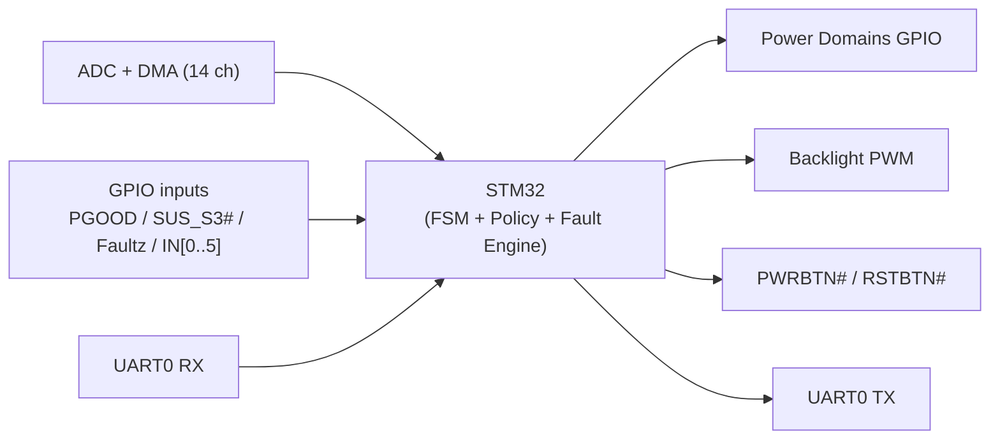

# POWER_Controller — интеграция Q7 (Linux)

MCU **STM32F030R8T6** — контроллер питания, мониторинга и защиты на плате с модулем Q7.  
Со стороны Linux вы — **master по UART**: команды, опрос телеметрии, политика восстановления после fault, OTA прошивки MCU.

---

## Роли MCU и Q7

| Сторона        | Ответственность                                                                                  |
| -------------- | ------------------------------------------------------------------------------------------------ |
| **MCU**        | Power sequencing, GPIO доменов, АЦП, защита, UART slave                                          |
| **Q7 (Linux)** | Master по UART: команды, опрос телеметрии, политика восстановления после fault, OTA прошивки MCU |

**Важно:** MCU **не шлёт** асинхронных событий. Актуальное состояние — только в ответе на `GET_STATUS` или ACK/NACK команды. О fault узнаёте при следующем опросе.

GPIO expander **IC17** (I2C) — на стороне Q7: через него можно аппаратно дергать `BOOT0`/`NRST` MCU. MCU с IC17 по I2C **не** общается.

---

## Архитектура


```mermaid
flowchart LR

    %% ===== INPUT =====
    ADC["ADC + DMA (14 ch)"]
    GPIO_IN["GPIO inputs<br/>PGOOD / SUS_S3# / Faultz / IN[0..5]"]
    UART_RX["UART0 RX"]

    %% ===== CORE =====
    CORE["STM32<br/>(FSM + Policy + Fault Engine)"]

    %% ===== OUTPUT =====
    DOM["Power Domains GPIO"]
    PWM["Backlight PWM"]
    BTN["PWRBTN# / RSTBTN#"]
    UART_TX["UART0 TX"]

    %% ===== FLOWS =====
    ADC --> CORE
    GPIO_IN --> CORE
    UART_RX --> CORE

    CORE --> DOM
    CORE --> PWM
    CORE --> BTN
    CORE --> UART_TX
```

---

## MCU

### После подачи питания

1. MCU выходит в **safe state**, инициализирует периферию.
2. Ждёт `PGOOD = HIGH` (до 5 с; иначе `FAULT_PGOOD_LOST`, остаётся в INIT).
3. Сам включает дисплейный тракт: **SCALER + LCD** (power sequencing), **TOUCH**, питание **AUDIO** (усилитель в mute/shutdown).
4. **Подсветка OFF** — яркость только по вашим командам.

Ожидаемая маска `state` после старта: `SCALER | LCD | TOUCH | AUDIO` (без `BACKLIGHT`).

### Автозапуск Linux (не UART)

Если `PGOOD = HIGH`, а `SUS_S3# = LOW` дольше **500 мс**, MCU имитирует нажатие кнопки питания: импульс **150 мс** на `PWRBTN#`, не чаще **1 раз / 5 с**.  
`SUS_S3# = HIGH` — Linux считается работающим.

### Safe state и fault

При старте и при **любом** подтверждённом fault MCU переводит все домены в safe state:

- домены питания (active HIGH) — **OFF**;
- `PWRBTN#` / `RSTBTN#` — release (Hi-Z);
- усилитель: `SDZ = LOW`, `MUTE = HIGH`.

`fault_flags` — **защёлка**: не сбрасываются сами.  
`RESET_FAULT` только очищает флаги; нагрузки **не** включаются — нужен явный `POWER_CTRL`.

Подтверждение аварии по порогам: окно 8 измерений, **5 подряд** вне порога

### Инварианты, которые нельзя нарушать с хоста

| Правило                                          | Последствие нарушения                               |
| ------------------------------------------------ | --------------------------------------------------- |
| `BACKLIGHT=ON` только при `SCALER=ON` и `LCD=ON` | `POWER_CTRL` → `status=0x01`, состояние не меняется |
| Master — только Q7                               | MCU не инициирует кадры                             |
| Неверный CRC                                     | кадр игнорируется, ответа может не быть             |
| `RESET_FAULT` ≠ автовключение                    | после сброса флагов — свой сценарий `POWER_CTRL`    |
| Нет push о fault                                 | только `GET_STATUS`                                 |

---

## Подключение UART0

| Параметр             | Значение                                                                           |
| -------------------- | ---------------------------------------------------------------------------------- |
| Интерфейс            | UART0 (связь Q7 ↔ MCU)                                                             |
| Скорость             | **115200**, 8N1, без flow control                                                  |
| Пины MCU             | `PA9` = TX MCU → RX Q7; `PA10` = RX MCU ← TX Q7                                    |
| Net-имена на разъёме | `UART0_RX` / `UART0_TX` — **со стороны Q7** (перекрёстное подключение к USART MCU) |

На Linux откройте tty, `115200 8N1`, парсер кадра `[STX][CMD][LEN][DATA][CRC][ETX]`.

После reset MCU готов принимать команды **не позднее 100 мс**; до первого успешного обмена возможны таймауты — синхронизация через `PING`.

---

## Старт

1. **PING** `0x01` → в ответе `status = 0xAA` (MCU alive).
2. **GET_STATUS** `0x04` → `LEN = 26`, разобрать телеметрию.
3. Проверить после старта: `SCALER=ON`, `LCD=ON`, `BACKLIGHT=OFF`.

### Рекомендуемый цикл опроса

- Периодический **GET_STATUS** (1–10 Гц — по UI/логированию).
- Команды управления — по событию (`POWER_CTRL`, `SET_BRIGHTNESS`, …).
- При `fault_flags != 0` — не «дожимать» включение;

### Чек-лист

- [ ] PING → `0xAA`
- [ ] GET_STATUS → 26 байт DATA, CRC сходится
- [ ] `BACKLIGHT=ON` только при `SCALER` и `LCD` уже ON
- [ ] После fault: `RESET_FAULT` снимает флаги, домены **не** включаются сами
- [ ] `BOOTLOADER_ENTER` → ACK → прошивка через ROM bootloader на том же UART0

---

## Протокол UART

### Кадр

```
[STX=0x02][CMD][LEN][DATA...][CRC8][ETX=0x03]
```

- `LEN` — только длина **DATA** (0…255).
- **CRC8/ATM**: poly `0x07`, init `0x00`, по байтам `[CMD][LEN][DATA...]` (без STX/ETX).
- **Little Endian** для `uint16` / `int16`.
- Единицы: напряжение **мВ**, ток **мА**, PWM **0…1000** (= 0…100%).

Таймауты приёма на MCU: межбайтовый **10 мс**, пакет **50 мс**.

### Статусы ответа

| Значение | Смысл                                                          |
| -------- | -------------------------------------------------------------- |
| `0x00`   | OK (для большинства команд)                                    |
| `0x01`   | запрос некорректен / запрещён политикой, состояние не меняется |
| `0xAA`   | только для `PING` — MCU alive                                  |

Неизвестная команда: ответ `CMD=0xFF`, `DATA=error_code` (`0x01` unknown, `0x02` queue overflow) — или отсутствие ответа.

### Примеры кадров (hex, CRC-8/ATM)

- PING request: `02 01 00 15 03`
- PING response (`status=0xAA`): `02 01 01 AA 21 03`
- GET_STATUS request: `02 04 00 54 03`
- POWER_CTRL: включить SCALER+LCD (`mask=0x0003`, `value=0x0003`): `02 02 04 03 00 03 00 D8 03`
- SET_BRIGHTNESS `pwm=500`: `02 03 02 F4 01 AB 03`

---

## Команды

| CMD  | Имя              | Request LEN | Response DATA    |
| ---- | ---------------- | ----------- | ---------------- |
| 0x01 | PING             | 0           | 1 (`0xAA`)       |
| 0x02 | POWER_CTRL       | 4           | 1 (`status`)     |
| 0x03 | SET_BRIGHTNESS   | 2           | 1                |
| 0x04 | GET_STATUS       | 0           | **26**           |
| 0x05 | RESET_FAULT      | 0           | 1                |
| 0x06 | RESET_BRIDGE     | 0           | 1                |
| 0x07 | SET_THRESHOLDS   | переменный  | 1                |
| 0x08 | BOOTLOADER_ENTER | 0           | 1 (ACK до reset) |
| 0x09 | CALIBRATE_OFFSET | 0           | 1                |

### POWER_CTRL (0x02)

`mask:uint16` + `value:uint16` — для каждого бита `i`: если `mask[i]=1`, домен `i` → `value[i]` (0=OFF, 1=ON).

| Бит | Домен     |
| --- | --------- |
| 0   | SCALER    |
| 1   | LCD       |
| 2   | BACKLIGHT |
| 3   | AUDIO     |
| 4   | ETH1      |
| 5   | ETH2      |
| 6   | TOUCH     |

Если **хотя бы одно** изменение нарушает политику (например `BACKLIGHT=ON` при выключенных SCALER/LCD) — вся команда отклоняется: `status=0x01`, **ничего** не применяется.

`SET_BRIGHTNESS`: `pwm` 0…1000; имеет смысл при включённой подсветке.

`RESET_BRIDGE`: импульс reset LVDS-моста **10 мс** LOW (при уже включённом дисплее).

`SET_THRESHOLDS`: пороги защит в рантайме (мВ / мА); формат `mask` + поля по битам.

`BOOTLOADER_ENTER`: ACK → safe state → reset → ROM bootloader на **UART0** (`0x1FFFD800` для APM32F030R8T6; `0x1FFFEC00` для STM32F030x8 — см. `ROM_BOOTLOADER_ADDR` в `config.h`). После команды связь с приложением обрывается — будьте готовы к OTA-сессии.

`CALIBRATE_OFFSET`: при **нулевой** нагрузке и **выключенных доменах** (`GET_STATUS.state == 0`) сохранить offset во flash MCU. Перед командой: при fault — `RESET_FAULT`, затем выключить все домены. При включённых доменах — `status=0x01`, flash не пишется.

---

## GET_STATUS

Ответ: **строго 26 байт** DATA. Парсить **по offset**, не через `struct` без `packed`.

| Offset | Поле          | Тип    | Описание                                  |
| :----- | :------------ | :----- | :---------------------------------------- |
| 0      | `v24`         | uint16 | 24V, мВ                                   |
| 2      | `v12`         | uint16 | 12V, мВ                                   |
| 4      | `v5`          | uint16 | 5V, мВ                                    |
| 6      | `v3v3`        | uint16 | 3.3V, мВ                                  |
| 8      | `i_lcd`       | int16  | ток LCD, мА (знаковый; у нуля возможны отриц. значения) |
| 10     | `i_backlight` | int16  | ток подсветки, мА                         |
| 12     | `i_scaler`    | int16  | ток scaler, мА                            |
| 14     | `i_audio_l`   | int16  | ток audio L, мА                           |
| 16     | `i_audio_r`   | int16  | ток audio R, мА                           |
| 18     | `temp0`       | int16  | резерв; без NTC = **-32768**              |
| 20     | `temp1`       | int16  | резерв; без NTC = **-32768**              |
| 22     | `state`       | uint8  | маска доменов (биты 0…6 как в POWER_CTRL) |
| 23     | `fault_flags` | uint16 | защёлкнутые причины fault                 |
| 25     | `inputs`      | uint8  | дискретные входы                          |

### `inputs`

- `bit0…5` = `IN_0…IN_5`
- `bit6` = `PGOOD` (1 = HIGH, питание в норме)
- `bit7` = `Faultz` (1 = HIGH, ошибки усилителя нет)

### `fault_flags` (основные биты)

| Бит  | Имя                | Смысл (кратко)             |
| ---- | ------------------ | -------------------------- |
| 0    | `FAULT_SCALER`     | авария домена SCALER       |
| 1    | `FAULT_LCD`        | авария LCD                 |
| 2    | `FAULT_BACKLIGHT`  | авария подсветки           |
| 3    | `FAULT_AUDIO`      | перегрузка / fault аудио   |
| 7    | `FAULT_PGOOD_LOST` | потеря PGOOD               |
| 8    | `FAULT_AMP_FAULTZ` | вход Faultz усилителя      |
| 9–12 | `FAULT_V*_RANGE`   | напряжение вне порога      |
| 13   | `FAULT_SEQ_ABORT`  | прерван display sequencing |

Телеметрия допускает погрешность порядка **±10%** (АЦП, делители, датчики). Токи могут «упираться» в потолок из‑за VDDA 2.5 В (~3.2 А max на канал) — см. прошивочную документацию.

---

## Операционные сценарии

### После подачи питания

MCU сам поднимает SCALER/LCD/TOUCH/AUDIO; подсветка выключена.  
Дальше — ваши команды.

### Включить подсветку

Предусловие: `SCALER=ON`, `LCD=ON` (после старта обычно уже так).

1. `POWER_CTRL`: `mask=bit2`, `value=bit2` (BACKLIGHT ON).
2. `SET_BRIGHTNESS`: `pwm` 0…1000.

MCU выполнит sequencing (задержки порядка 50–200 мс на шаг) — не слать повторный `BACKLIGHT=ON`, пока не получили ответ или таймаут.

### Выключить только подсветку

`POWER_CTRL`: сбросить bit2 (BACKLIGHT OFF) — PWM=0, `BACKLIGHT_ON` LOW; **SCALER/LCD остаются ON**.

### Полное выключение дисплея

`POWER_CTRL`: снять `SCALER` / `LCD` / `BACKLIGHT` — MCU выполнит полный shutdown sequencing.

### Включить звук

При старте питание AUDIO уже ON, усилитель в safe.  
`POWER_CTRL`: `mask=bit3`, `value=bit3` (AUDIO ON) — MCU выполнит unmute/unshutdown (паузы ~10 мс между шагами).

### Восстановление после fault

```text
GET_STATUS  →  fault_flags != 0, домены OFF
RESET_FAULT →  fault_flags = 0 (нагрузки всё ещё OFF)
POWER_CTRL  →  явное включение нужных доменов
```

Не повторяйте `RESET_FAULT` вместо включения — домены сами не поднимутся.

### Сброс LVDS-моста

`RESET_BRIDGE (0x06)` — при включённом дисплее (SCALER+LCD ON).

### Обновление прошивки MCU

**Штатно:** `BOOTLOADER_ENTER (0x08)` → ACK (`status=0x00`) → reset → ROM bootloader на UART0 (`ROM_BOOTLOADER_ADDR`, сейчас `0x1FFFD800` для APM32).

**Резерв (аппаратно):** через IC17 на Q7: `BOOT0=HIGH`, импульс `NRST`.

### Калибровка нуля токов

При гарантированно нулевой нагрузке и `state==0`: `RESET_FAULT` (если нужно) → выключить домены → `CALIBRATE_OFFSET (0x09)`. Выполнять редко (запись во flash).

---

## Диагностика

| Симптом                   | Вероятная причина          | Что проверить                                   |
| ------------------------- | -------------------------- | ----------------------------------------------- |
| Нет ответа на команды     | CRC, порт, скорость, TX/RX | CRC8/ATM; 115200 8N1; перекрёст TX/RX           |
| PING без ответа           | MCU не стартовал, обрыв    | `PGOOD`, питание 3.3V_A; повторить после 100 мс |
| GET_STATUS «короче 26»    | неверный парсер            | `LEN` в кадре = 26 для DATA                     |
| BACKLIGHT `status=1`      | нет SCALER/LCD             | поле `state` в GET_STATUS                       |
| После RESET_FAULT всё OFF | норма                      | нужен POWER_CTRL                                |
| Токи на max               | клиппинг АЦП               | см. POWER_Controller.md                         |
| temp0/temp1 «странные»    | NTC нет                    | должно быть -32768                              |

---

## Домены и сигналы

Управляемые домены в `state` / `POWER_CTRL`: **SCALER, LCD, BACKLIGHT, AUDIO, ETH1, ETH2, TOUCH**.

Дискретные входы в `inputs`: **PGOOD, SUS_S3#, Faultz, IN_0…IN_5**.

MCU также управляет (без отдельных UART-полей): PWM подсветки, reset моста CH7511b, линиями усилителя, импульсами `PWRBTN#` / `RSTBTN#`.
