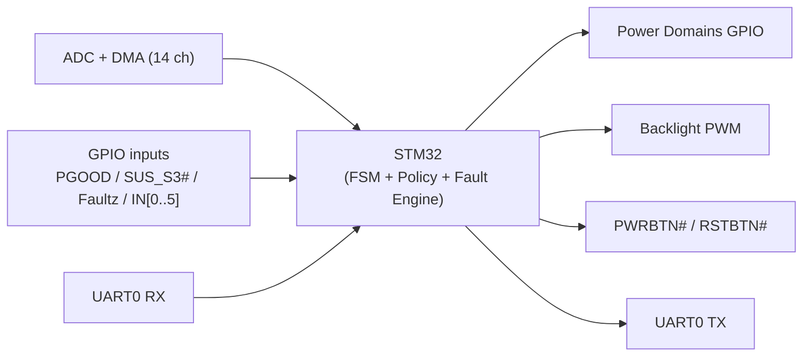
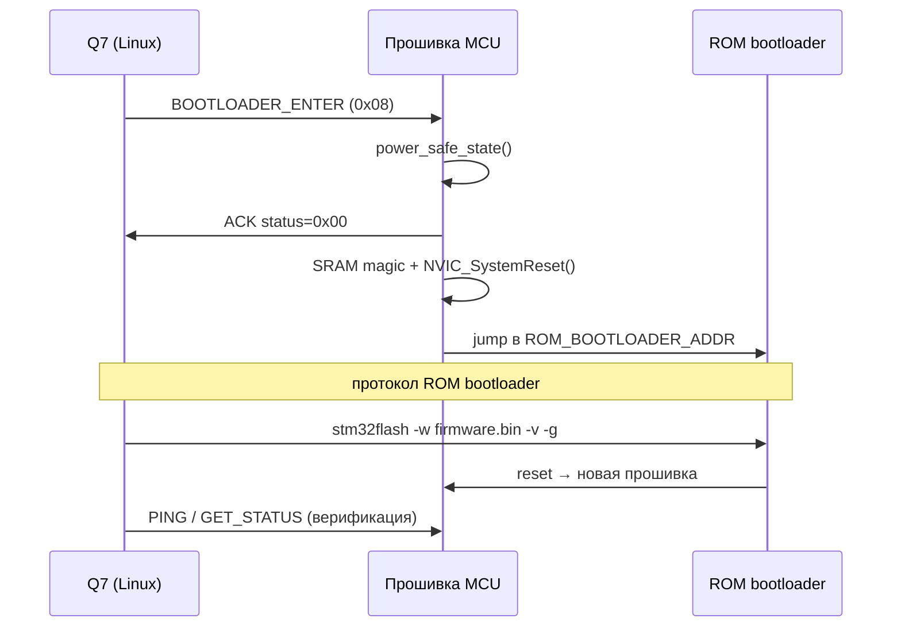

# POWER_Controller

## Роли MCU и Q7

| Сторона        | Ответственность                                                                                  |
| -------------- | ------------------------------------------------------------------------------------------------ |
| **MCU**        | Power sequencing, GPIO доменов, АЦП, защита, UART slave                                          |
| **Q7 (Linux)** | Master по UART: команды, опрос телеметрии, политика восстановления после fault, OTA прошивки MCU |

**Важно:** MCU **не шлёт** асинхронных событий. Актуальное состояние — только в ответе на `GET_STATUS` или ACK/NACK команды. О fault узнаёте при следующем опросе.

GPIO expander **IC17** (I2C) — на стороне Q7: через него можно аппаратно дергать `BOOT0`/`NRST` MCU. MCU с IC17 по I2C **не** общается.

---

## Архитектура


```mermaid
flowchart LR

    %% ===== INPUT =====
    ADC["ADC + DMA (14 ch)"]
    GPIO_IN["GPIO inputs<br/>PGOOD / SUS_S3# / Faultz / IN[0..5]"]
    UART_RX["UART0 RX"]

    %% ===== CORE =====
    CORE["STM32<br/>(FSM + Policy + Fault Engine)"]

    %% ===== OUTPUT =====
    DOM["Power Domains GPIO"]
    PWM["Backlight PWM"]
    BTN["PWRBTN# / RSTBTN#"]
    UART_TX["UART0 TX"]

    %% ===== FLOWS =====
    ADC --> CORE
    GPIO_IN --> CORE
    UART_RX --> CORE

    CORE --> DOM
    CORE --> PWM
    CORE --> BTN
    CORE --> UART_TX
```

---

## MCU

### После подачи питания

1. MCU выходит в **safe state**, инициализирует периферию. `ETH1` и `ETH2` при этом остаются включёнными.
2. Ждёт `PGOOD = HIGH` (до 5 с; иначе `FAULT_PGOOD_LOST`, остаётся в INIT).
3. Сам включает дисплейный тракт: **SCALER + LCD + BACKLIGHT**
4. Яркость по умолчанию — `BACKLIGHT_DEFAULT_PWM_ON`; точная настройка — `SET_BRIGHTNESS`. **TOUCH** и **AUDIO** не включаются автоматически.

Ожидаемая маска `state` после старта: `ETH1 | ETH2 | SCALER | LCD | BACKLIGHT` (`0x37` при включённом auto-BL).

### Автозапуск Linux (не UART)

Если `PGOOD = HIGH`, а `SUS_S3# = LOW` дольше **500 мс**, MCU имитирует нажатие кнопки питания: импульс **150 мс** на `PWRBTN#`, не чаще **1 раз / 5 с**.  
`SUS_S3# = HIGH` — Linux считается работающим.

### Safe state и fault

При старте и при **любом** подтверждённом fault MCU переводит систему в safe state:

- домены питания (active HIGH) — **OFF**, кроме `ETH1` и `ETH2`, которые всегда остаются **ON**;
- `PWRBTN#` / `RSTBTN#` — release (Hi-Z);
- усилитель: `SDZ = LOW`, `MUTE = HIGH`.

`fault_flags` — **защёлка**: не сбрасываются сами.  
`RESET_FAULT` только очищает флаги; нагрузки **не** включаются — нужен явный `POWER_CTRL`.

Подтверждение аварии по порогам: окно 8 измерений, **5 подряд** вне порога

### Инварианты, которые нельзя нарушать с хоста

| Правило                                           | Последствие нарушения                               |
| ------------------------------------------------- | --------------------------------------------------- |
| `BACKLIGHT=ON` только при `SCALER=ON` и `LCD=ON`  | `POWER_CTRL` → `status=0x01`, состояние не меняется |
| Master — только Q7                                | MCU не инициирует кадры                             |
| Неверный CRC / фрейминг / таймаут / мусор без STX | NACK `CMD=0xFF`, `error_code` 0x03–0x07             |
| `RESET_FAULT` ≠ автовключение                     | после сброса флагов — свой сценарий `POWER_CTRL`    |
| Нет push о fault                                  | только `GET_STATUS`                                 |

---

## Подключение UART0

| Параметр             | Значение                                                                           |
| -------------------- | ---------------------------------------------------------------------------------- |
| Интерфейс            | UART0 (связь Q7 ↔ MCU)                                                             |
| Скорость             | **115200**, 8N1, без flow control                                                  |
| Пины MCU             | `PA9` = TX MCU → RX Q7; `PA10` = RX MCU ← TX Q7                                    |
| Net-имена на разъёме | `UART0_RX` / `UART0_TX` — **со стороны Q7** (перекрёстное подключение к USART MCU) |

После reset MCU готов принимать команды **не позднее 100 мс**; до первого успешного обмена возможны таймауты — синхронизация через `PING`.

---

## Старт

1. **PING** `0x01` → в ответе `status = 0xAA` (MCU alive).
2. **GET_STATUS** `0x04` → `LEN = 22` (`0x16`), разобрать телеметрию.
3. Проверить после старта: `SCALER=ON`, `LCD=ON`, `BACKLIGHT=ON` (или `0x03` без auto-BL, если `ENABLE_BACKLIGHT_AUTO_STARTUP=0`).

### Рекомендуемый цикл опроса

- Периодический **GET_STATUS** (1–10 Гц — по UI/логированию).
- Команды управления — по событию (`POWER_CTRL`, `SET_BRIGHTNESS`, …).
- При `fault_flags != 0` — не «дожимать» включение;

---

## Протокол UART

### Кадр

```
[STX=0x02][CMD][LEN][DATA...][CRC8][ETX=0x03]
```

- `LEN` — только длина **DATA** (0…255).
- **CRC8/ATM**: poly `0x07`, init `0x00`, по байтам `[CMD][LEN][DATA...]` (без STX/ETX).
- **Little Endian** для `uint16` / `int16`.
- Единицы: напряжение **мВ**, ток **мА**, PWM **0…1000** (= 0…100%).

Таймауты приёма на MCU: межбайтовый **10 мс**, пакет **50 мс**.

### Статусы ответа

| Значение | Смысл                                                          |
| -------- | -------------------------------------------------------------- |
| `0x00`   | OK (для большинства команд)                                    |
| `0x01`   | запрос некорректен / запрещён политикой, состояние не меняется |
| `0xAA`   | только для `PING` — MCU alive                                  |

Неизвестная команда: ответ `CMD=0xFF`, `DATA=error_code` (`0x01` unknown, `0x02` queue overflow, `0x03` CRC, `0x04` framing, `0x05` timeout, `0x06` RX overflow, `0x07` случайный байт без `STX`). Любой байт, полученный вне валидного кадра, получает NACK.

### Примеры кадров (hex, CRC-8/ATM)

- PING request: `02 01 00 15 03`
- PING response (`status=0xAA`): `02 01 01 AA 21 03`
- GET_STATUS request: `02 04 00 54 03`
- POWER_CTRL: включить SCALER+LCD (`mask=0x0003`, `value=0x0003`): `02 02 04 03 00 03 00 D8 03`
- SET_BRIGHTNESS `pwm=500`: `02 03 02 F4 01 AB 03`

---

## Команды

| CMD  | Имя              | Request LEN | Response DATA    |
| ---- | ---------------- | ----------- | ---------------- |
| 0x01 | PING             | 0           | 1 (`0xAA`)       |
| 0x02 | POWER_CTRL       | 4           | 1 (`status`)     |
| 0x03 | SET_BRIGHTNESS   | 2           | 1                |
| 0x04 | GET_STATUS       | 0           | **22**           |
| 0x05 | RESET_FAULT      | 0           | 1                |
| 0x06 | RESET_BRIDGE     | 0           | 1                |
| 0x07 | SET_THRESHOLDS   | переменный  | 1                |
| 0x08 | BOOTLOADER_ENTER | 0           | 1 (ACK до reset) |
| 0x09 | CALIBRATE_OFFSET | 0           | 1                |
| 0x0A | GET_VERSION      | 0           | **8**            |
| 0x0B | READ_FLASH       | 5           | **1…64** (`status` + data) |

### POWER_CTRL (0x02)

`mask:uint16` + `value:uint16` — для каждого бита `i`: если `mask[i]=1`, домен `i` → `value[i]` (0=OFF, 1=ON).

| Бит | Домен     |
| --- | --------- |
| 0   | SCALER    |
| 1   | LCD       |
| 2   | BACKLIGHT |
| 3   | AUDIO     |
| 4   | ETH1      |
| 5   | ETH2      |
| 6   | TOUCH     |

Если **хотя бы одно** изменение нарушает политику (например `BACKLIGHT=ON` при выключенных SCALER/LCD) — вся команда отклоняется: `status=0x01`, **ничего** не применяется.

`SET_BRIGHTNESS`: `pwm` 0…1000; имеет смысл при включённой подсветке.

`RESET_BRIDGE`: импульс reset LVDS-моста **10 мс** LOW (при уже включённом дисплее).

`SET_THRESHOLDS`: пороги защит в рантайме (мВ / мА); формат `mask` + поля по битам.

`BOOTLOADER_ENTER`: ACK → safe state → reset → ROM bootloader на **UART0** (`0x1FFFD800` для APM32F030R8T6; `0x1FFFEC00` для STM32F030x8 — см. `ROM_BOOTLOADER_ADDR` в `config.h`). После команды связь с приложением обрывается — будьте готовы к OTA-сессии.

`CALIBRATE_OFFSET`: при **нулевой** нагрузке и **выключенных управляемых доменах** (`GET_STATUS.state == 0x30`, только `ETH1|ETH2`) сохранить offset во flash MCU. Перед командой: при fault — `RESET_FAULT`, затем выключить все домены кроме always-on ETH. При любых других битах в `state` — `status=0x01`, flash не пишется.

`GET_VERSION`: версия прошивки и CRC32 образа (тот же CRC, что используется OTA/boot_meta). Версия задаётся в `Config/config.h` (`FW_VERSION_MAJOR` / `FW_VERSION_MINOR`).

`READ_FLASH`: чтение блока flash MCU по адресу (бэкап прошивки без входа в ROM-bootloader). Запрос: `addr:uint32_le` + `len:uint8` (1…63). Ответ: `status` (`0x00` = OK) + до `len` байт данных. Допустимый диапазон адресов: `0x08000000` … `0x08010000` (конец исключительный). Хост-инструмент: `make flash-dump`.

---

## GET_VERSION

Ответ: **8 байт** DATA (`LEN=0x08`, полный кадр 13 байт).

| Offset | Поле          | Тип    | Описание                                      |
| :----- | :------------ | :----- | :-------------------------------------------- |
| 0      | `fw_version`  | uint16 | `major<<8 \| minor` (по умолчанию `0x0101` = v1.1) |
| 2      | `firmware_crc`| uint32 | CRC32 образа (патчится `scripts/fw_sign.py`)  |
| 6      | `reserved`    | uint16 | `0x0000`                                      |

Пример запроса: `02 0A 00 82 03`

---

## READ_FLASH

Запрос: **5 байт** DATA (`LEN=0x05`): `addr:uint32_le` (offset 0) + `len:uint8` (offset 4, 1…63).

Ответ (успех): `status=0x00` + `len` байт данных (`LEN = 1 + len`, полный кадр `6 + len` байт).

Ответ (ошибка): `status=0x01`, `LEN=0x01`, данных нет.

Диапазон: `addr >= 0x08000000`, `addr + len <= 0x08010000` (конец исключительный, как `FLASH_CAL_VALID_*` в `config.h`).

Пример: прочитать 16 байт с начала flash (`0x08000000`):

- Запрос: `02 0B 05 00 00 00 08 10 D9 03` (`addr=0x08000000`, `len=0x10`)
- Ответ: `02 0B 11 00 <16 data bytes> <CRC> 03`

Бэкап образа на Q7: `make flash-dump OUT=backup.bin` (чанки по 63 байта, опциональная сверка CRC32 с `GET_VERSION`).

---

## GET_STATUS

Ответ: **строго 22 байта** DATA (`LEN=0x16`, полный кадр 27 байт). Парсить **по offset**, не через `struct` без `packed`.

| Offset | Поле          | Тип    | Описание                                                  |
| :----- | :------------ | :----- | :-------------------------------------------------------- |
| 0      | `v24`         | uint16 | 24V, мВ                                                   |
| 2      | `v12`         | uint16 | 12V, мВ                                                   |
| 4      | `v5`          | uint16 | 5V, мВ                                                    |
| 6      | `v3v3`        | uint16 | 3.3V, мВ                                                  |
| 8      | `i_lcd`       | int16  | ток LCD, мА (знаковый; у нуля возможны отриц. значения)   |
| 10     | `i_backlight` | int16  | ток подсветки, мА (`-32768` если датчик BL не установлен) |
| 12     | `i_scaler`    | int16  | ток scaler, мА                                            |
| 14     | `i_audio_l`   | int16  | ток audio L, мА                                           |
| 16     | `i_audio_r`   | int16  | ток audio R, мА                                           |
| 18     | `state`       | uint8  | маска доменов (биты 0…6 как в POWER_CTRL)                 |
| 19     | `fault_flags` | uint16 | защёлкнутые причины fault                                 |
| 21     | `inputs`      | uint8  | дискретные входы                                          |

### `inputs`

- `bit0…5` = `IN_0…IN_5`
- `bit6` = `PGOOD` (1 = HIGH, питание в норме)
- `bit7` = `Faultz` (1 = HIGH, ошибки усилителя нет)

### `fault_flags` (основные биты)

| Бит  | Имя                | Смысл (кратко)             |
| ---- | ------------------ | -------------------------- |
| 0    | `FAULT_SCALER`     | авария домена SCALER       |
| 1    | `FAULT_LCD`        | авария LCD                 |
| 2    | `FAULT_BACKLIGHT`  | авария подсветки           |
| 3    | `FAULT_AUDIO`      | перегрузка / fault аудио   |
| 7    | `FAULT_PGOOD_LOST` | потеря PGOOD               |
| 8    | `FAULT_AMP_FAULTZ` | вход Faultz усилителя      |
| 9–12 | `FAULT_V*_RANGE`   | напряжение вне порога      |
| 13   | `FAULT_SEQ_ABORT`  | прерван display sequencing |

Телеметрия допускает погрешность порядка **±10%** (АЦП, делители, датчики). Токи могут «упираться» в потолок из‑за VDDA 2.5 В (~3.2 А max на канал) — см. прошивочную документацию.

---

## Операционные сценарии

### После подачи питания

MCU сам поднимает SCALER/LCD/BACKLIGHT; TOUCH/AUDIO на данной ревизии не включаются.  
Дальше — ваши команды (яркость, выключение BL и т.д.).

### Настроить яркость подсветки

После старта `BACKLIGHT` уже ON (PWM = `BACKLIGHT_DEFAULT_PWM_ON`, обычно 50).

1. `SET_BRIGHTNESS`: `pwm` 0…1000.

Если auto-BL отключён (`ENABLE_BACKLIGHT_AUTO_STARTUP=0`): сначала `POWER_CTRL` bit2 ON, затем `SET_BRIGHTNESS`.

### Выключить только подсветку

`POWER_CTRL`: сбросить bit2 (BACKLIGHT OFF) — PWM=0, `BACKLIGHT_ON` LOW; **SCALER/LCD остаются ON**.

### Полное выключение дисплея

`POWER_CTRL`: снять `SCALER` / `LCD` / `BACKLIGHT` — MCU выполнит полный shutdown sequencing.

### Включить звук

При старте питание AUDIO уже ON, усилитель в safe.  
`POWER_CTRL`: `mask=bit3`, `value=bit3` (AUDIO ON) — MCU выполнит unmute/unshutdown (паузы ~10 мс между шагами).

### Восстановление после fault

```text
GET_STATUS  →  fault_flags != 0, домены OFF
RESET_FAULT →  fault_flags = 0 (нагрузки всё ещё OFF)
POWER_CTRL  →  явное включение нужных доменов
```

Не повторяйте `RESET_FAULT` вместо включения — домены сами не поднимутся.

### Сброс LVDS-моста

`RESET_BRIDGE (0x06)` — при включённом дисплее (SCALER+LCD ON).

### Обновление прошивки MCU

Штатный OTA-сценарий и скрипт — в разделе [OTA прошивки MCU (UART)](#ota-прошивки-mcu-uart) в конце документа.

**Кратко:** `BOOTLOADER_ENTER (0x08)` → ACK → reset → ROM bootloader на UART0 → `stm32flash` → верификация через `uart_wait_mcu_ready`.

**Резерв (аппаратно):** через IC17 на Q7: `BOOT0=HIGH`, импульс `NRST`.

### Калибровка нуля токов

При гарантированно нулевой нагрузке и `state==0x30` (только `ETH1|ETH2`): `RESET_FAULT` (если нужно) → выключить все домены кроме ETH → `CALIBRATE_OFFSET (0x09)`. Выполнять редко (запись во flash).

---

## Диагностика

| Симптом                   | Вероятная причина          | Что проверить                                   |
| ------------------------- | -------------------------- | ----------------------------------------------- |
| Нет ответа на команды     | CRC, порт, скорость, TX/RX | CRC8/ATM; 115200 8N1; перекрёст TX/RX           |
| PING без ответа           | MCU не стартовал, обрыв    | `PGOOD`, питание 3.3V_A; повторить после 100 мс |
| GET_STATUS «короче 22»    | неверный парсер            | `LEN` в кадре = `0x16` (22 DATA)                |
| BACKLIGHT `status=1`      | нет SCALER/LCD             | поле `state` в GET_STATUS                       |
| После RESET_FAULT всё OFF | норма                      | нужен POWER_CTRL                                |
| Токи на max               | клиппинг АЦП               | см. POWER_Controller.md                         |

---

## Домены и сигналы

Управляемые домены в `state` / `POWER_CTRL`: **SCALER, LCD, BACKLIGHT, AUDIO, ETH1, ETH2, TOUCH**.

`ETH1`/`ETH2` включены по умолчанию сразу после старта прошивки (ещё до `PGOOD`), не участвуют в секвенсировании дисплея и никогда не выключаются прошивкой: ни по `POWER_CTRL`, ни по fault. В `GET_STATUS.state` биты ETH всегда `1` (минимальная маска после safe state — `0x30`). Команды `POWER_CTRL` с битами ETH принимаются, но физически игнорируются.

Дискретные входы в `inputs`: **PGOOD, SUS_S3#, Faultz, IN_0…IN_5**.

MCU также управляет (без отдельных UART-полей): PWM подсветки, reset моста CH7511b, линиями усилителя, импульсами `PWRBTN#` / `RSTBTN#`.

---

## OTA прошивки MCU (UART)

Обновление прошивки — **двухфазный процесс**: сначала приложение MCU по своему UART-протоколу передаёт управление ROM-bootloader, затем Q7 (Linux) записывает flash стандартным USART-bootloader на **том же UART0**.

| Фаза        | Кто говорит         | Протокол                              | Результат                     |
| ----------- | ------------------- | ------------------------------------- | ----------------------------- |
| 1. Handoff  | Q7 → приложение MCU | `[STX][CMD][LEN][DATA][CRC][ETX]`     | ACK + reset                   |
| 2. Прошивка | Q7 → ROM bootloader | STM32 USART bootloader (`stm32flash`) | `.bin` записан во flash       |
| 3. Старт    | MCU                 | —                                     | новая прошивка с `0x08000000` |

**Параметры:** UART0, **115200 8N1**, без flow control. Flash MCU — **64 КБ**, база **`0x08000000`**. Образ: `build/POWER_Controller.bin` (после `make all` — с CRC-футером, см. ниже).

**Бэкап перед OTA:** `make flash-dump OUT=backup.bin` читает flash через прикладной протокол (`READ_FLASH`), без входа в ROM-bootloader. Альтернатива — `stm32flash -r` после `BOOTLOADER_ENTER` или аппаратного BOOT0.

**Сборка:** `make all` собирает `.elf`, затем `scripts/fw_sign.py` патчит CRC32-футер в `.bin` и пересобирает `.hex`. Для OTA и `make ota-flash` нужен именно этот подписанный `.bin`; сырой вывод `objcopy` без `fw_sign` не пройдёт `boot_meta_confirm()` на устройстве.

**Разметка flash (хвост, 2 КБ зарезервировано линкером):**

| Адрес        | Размер | Назначение                          |
| ------------ | ------ | ----------------------------------- |
| `0x0800F800` | 1 КБ   | Boot metadata (`boot_meta_t`)       |
| `0x0800FC00` | 1 КБ   | Калибровка токов (`flash_cal_t`)    |

Приложение линкуется в первые **62 КБ** (`STM32F030XX_FLASH.ld`); переполнение — ошибка линковки, а не тихая перезапись метаданных.


```mermaid
sequenceDiagram
    participant Q7 as Q7 (Linux)
    participant App as Прошивка MCU
    participant ROM as ROM bootloader

    Q7->>App: BOOTLOADER_ENTER (0x08)
    App->>App: power_safe_state()
    App->>Q7: ACK status=0x00
    App->>App: SRAM magic + NVIC_SystemReset()
    App->>ROM: jump в ROM_BOOTLOADER_ADDR
    Note over Q7,ROM: протокол ROM bootloader
    Q7->>ROM: stm32flash -w firmware.bin -v -g
    ROM->>App: reset → новая прошивка
    Q7->>App: PING / GET_STATUS (верификация)
```

### Что делает MCU (внутренний сценарий)

При `BOOTLOADER_ENTER (0x08)`:

1. **`power_safe_state()`** — все домены OFF, кроме always-on `ETH1`/`ETH2` (`state = 0x30`)
2. **ACK** с `status=0x00` (отправляется **до** reset — UART TX должен завершиться)
3. **`bootloader_schedule()`** — флаг в main loop
4. **`bootloader_process()`** — запись SRAM magic `0xDEADBEEF` в секцию `.noinit`, `NVIC_SystemReset()`
5. После reset **`bootloader_check()`** (до `HAL_Init`) — jump в ROM по `ROM_BOOTLOADER_ADDR`

| MCU                     | `ROM_BOOTLOADER_ADDR` |
| ----------------------- | --------------------- |
| **APM32F030x8** (плата) | `0x1FFFD800`          |
| STM32F030x8             | `0x1FFFEC00`          |

После jump прикладной протокол `[STX]…[ETX]` **не работает** — активен ROM USART-bootloader.

### Авто-восстановление после неудачного OTA (`boot_meta`)

Альтернатива полноценному A/B dual-bank на 64 КБ flash: метаданные в странице `0x0800F800` + CRC32 образа (футер `.fw_crc`, патчится `fw_sign.py`).

| Этап | Поведение |
| ---- | --------- |
| После OTA | `boot_meta_on_startup()` видит неподтверждённый образ или смену `firmware_crc` → уменьшает `boot_attempts` (стартовое значение 3) |
| Успешный self-test | `boot_meta_confirm()` после ADC DMA + TIM17 PWM → `confirmed=1`, запись CRC |
| 3 ресета без confirm | `bootloader_schedule()` → уход в ROM-bootloader для перезаливки с Q7 |

Ручной `BOOTLOADER_ENTER` по-прежнему работает. Авто-вход в ROM-bootloader дополняет его, когда прошивка зависла до ответа на UART.

### Ручной сценарий (пошагово)

#### Фаза 0: проверка связи

```bash
stty -F "$UART_DEVICE" 115200 cs8 -cstopb -parenb -icanon -echo min 0 time 0
sleep 0.5   # USB-UART может дёрнуть DTR → reset MCU
```

**PING** — запрос: `02 01 00 15 03` → ответ: `02 01 01 AA 21 03` (`status = 0xAA`).

#### Фаза 1: вход в ROM-bootloader

**BOOTLOADER_ENTER** — запрос: `02 08 00 A8 03` → ответ: `02 08 01 00 B0 03` (`status = 0x00`).

Подождать **300–500 мс**, сбросить RX-буфер порта.

#### Фаза 2: запись прошивки

```bash
stm32flash -b 115200 \
  -w build/POWER_Controller.bin \
  -v \
  -g 0x08000000 \
  "$UART_DEVICE"
```

| Флаг            | Назначение                    |
| --------------- | ----------------------------- |
| `-w`            | Запись файла                  |
| `-v`            | Верификация образа во flash   |
| `-g 0x08000000` | Reset и запуск с начала flash |

#### Фаза 3: верификация после прошивки

| Проверка           | Что закрывает              | Как                               |
| ------------------ | -------------------------- | --------------------------------- |
| Целостность образа | `stm32flash -v`            | Побайтовое сравнение при записи   |
| Старт приложения   | `uart_wait_mcu_ready()`    | PING → `0xAA` (до 30 с)           |
| Протокол жив       | `GET_STATUS` (опционально) | 27 байт, `LEN=0x16`, CRC сходится |

**GET_STATUS** — запрос: `02 04 00 54 03`.

### Аппаратный резерв (IC17 на Q7)

Если прошивка не отвечает или `BOOTLOADER_ENTER` недоступен — вход в ROM-bootloader **без участия flash-приложения**:

```text
1. P1_1 = HIGH  → BOOT0 = 1
2. P1_0 = LOW   → удержание NRST
3. P1_0 = HIGH  → импульс reset
4. stm32flash … (Фаза 2)
5. P1_1 = LOW   → BOOT0 = 0 (нормальный режим)
```

В idle резистор R119 тянет `BOOT0` к GND — MCU стартует из flash приложения.

В OTA-скрипте этот путь подключается через `OTA_IC17_RECOVERY_CMD` — Q7-скрипт управления IC17 в репозитории пока не включён, задаётся снаружи.
